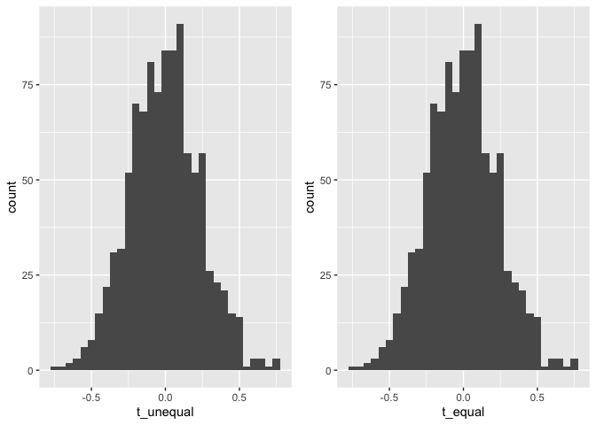
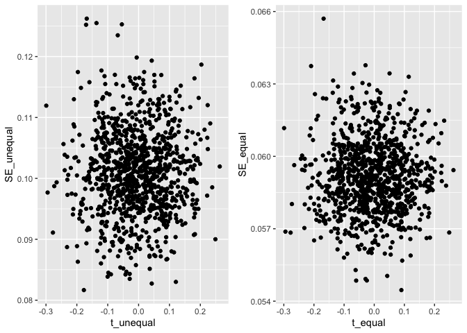
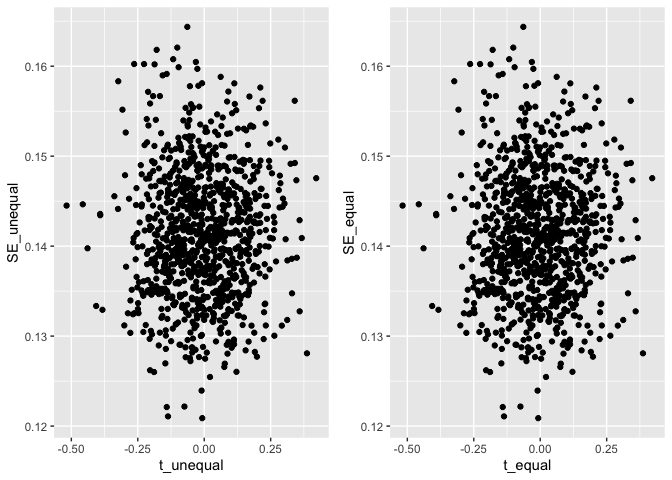
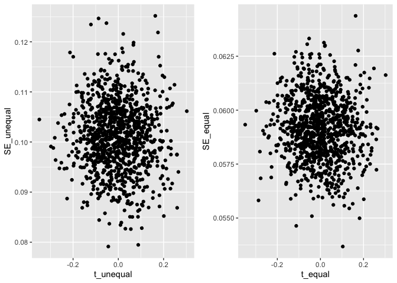

Which t-test should I use? A simulation study comparing the Student and
Welch t-test
================
Group 2 - Lily, Daniel, Anna and Em,
2023-06-22

## Study Design

### Aim

To compare the performance of two different specifications of the
two-sample t test when variances are unequal and group sizes are both
equal and unequal

### Data Generation Mechanisms

We decided on 9 different DGMS, varying both the sample sizes and the
degree to which the variance differed. They were as follows:

``` r
nsim <- 1000
dgm <- 1:9
n1 <- c(rep(100,9))
n2 <- c(100,200,1000,100,200,1000,100,200,1000)
mu1 <- c(rep(5,9))
mu2 <- c(rep(5,9))
sd1 <- c(rep(1,9))
sd2 <- c(1,3,0.5,1,3,0.5,1,3,0.5)
df <- data.frame(n1,n2,mu1,mu2,sd1,sd2)
df
```

    ##    n1   n2 mu1 mu2 sd1 sd2
    ## 1 100  100   5   5   1 1.0
    ## 2 100  200   5   5   1 3.0
    ## 3 100 1000   5   5   1 0.5
    ## 4 100  100   5   5   1 1.0
    ## 5 100  200   5   5   1 3.0
    ## 6 100 1000   5   5   1 0.5
    ## 7 100  100   5   5   1 1.0
    ## 8 100  200   5   5   1 3.0
    ## 9 100 1000   5   5   1 0.5

### Estimand(s)

The estimand was the difference in means.

### Methods

We compared two different t-tests, one of which was just a standard
Student’s t-test (which assumes equal variances), and one which allows
for different variances in the two groups (Welch’s t-test). We therefore
had two methods:

1)  standard t-test (t_equal)
2)  Welch t-test (t_unequal)

### Performance

We aimed to look at bias and coverage together with monte carlo standard
errors. We also conducted a number of sense checks: - plotting the
estimated mean differences - comparing the model-based and empirical
standard errors

We ran 1000 simulations.

## Simulation set-up

``` r
library(foreach)
library(dplyr)
library(tidyr)
library(ggplot2)
library(gt)

set.seed(1234)

sim <- function(n1,n2,mu1,mu2,sd1,sd2,dgm){

df1 <- data.frame(id = 1:n1, group = 1, value = rnorm(n1,mu1,sd1))
df2 <- data.frame(id = 1:n2, group = 2, value = rnorm(n2,mu2,sd2))

ttest <- t.test(y = df1$value, x = df2$value, paired = FALSE, var.equal = FALSE)
means <- ttest$estimate
diff_means <- means[1] - means[2]
CI_lower <- ttest$conf.int[1]
CI_upper <- ttest$conf.int[2]
SE <- ttest$stderr

ttest1 <- t.test(y = df1$value, x = df2$value, var.equal  = TRUE, paired = FALSE)
means1 <- ttest1$estimate
diff_means1 <- means1[1] - means1[2]
CI_lower1 <- ttest1$conf.int[1]
CI_upper1 <- ttest1$conf.int[2]
SE1 <- ttest1$stderr

output <- data.frame(diff_means,CI_lower,CI_upper,SE,diff_means1,CI_lower1,CI_upper1,SE1,dgm)
colnames(output) <- c("t_unequal","lower_unequal","upper_unequal","SE_unequal","t_equal","lower_equal", "upper_equal","SE_equal","DGM")
output
}
```

Running the simulation:

``` r
simulation <- foreach(j = dgm) %do% {
  foreach(i=1:nsim, .combine = "rbind") %do% {
  sim(n1[j],n2[j],mu1[j],mu2[j],sd1[j],sd2[j],j)
}
}
test <- data.frame(do.call(rbind.data.frame, simulation))
```

## Results

### Sense checks

Check the mean for each DGM in a histogram

``` r
library(cowplot)
check_mean <- function(dgm){
  plot1 <- ggplot(subset(test, DGM == dgm), aes(x =t_unequal)) +
    geom_histogram(binwidth = 0.05)
  plot2 <- ggplot(subset(test, DGM == dgm), aes(x =t_equal)) +
    geom_histogram(binwidth = 0.05)
  hist_mean <- plot_grid(plot1, plot2)
  hist_mean
}
check_mean(1)
```

<!-- -->

``` r
check_mean(2)
```

<!-- -->

``` r
check_mean(3)
```

<!-- -->

``` r
check_mean(4)
```

<!-- -->

``` r
check_mean(5)
```

<!-- -->

``` r
check_mean(6)
```

<!-- -->

``` r
check_mean(7)
```

<!-- -->

``` r
check_mean(8)
```

<!-- -->

``` r
check_mean(9)
```

<!-- --> Check
mean/se:

``` r
check_mean_se <- function(dgm){
  plot1 <- ggplot(subset(test, DGM == dgm), aes(x =t_unequal, y=SE_unequal)) +
    geom_point()
  plot2 <- ggplot(subset(test, DGM == dgm), aes(x =t_equal, y=SE_equal)) +
    geom_point()
  hist_mean_se <- plot_grid(plot1, plot2)
  hist_mean_se
}
check_mean_se(1)
```

<!-- -->

``` r
check_mean_se(2)
```

<!-- -->

``` r
check_mean_se(3)
```

<!-- -->

``` r
check_mean_se(4)
```

<!-- -->

``` r
check_mean_se(5)
```

<!-- -->

``` r
check_mean_se(6)
```

<!-- -->

``` r
check_mean_se(7)
```

<!-- -->

``` r
check_mean_se(8)
```

<!-- -->

``` r
check_mean_se(9)
```

<!-- -->

## Results: bias

bias of t_equal:

``` r
test %>%
  group_by(DGM) %>%
  summarise(
    bias = mean(t_equal) - (0),
    empSE = sqrt(var(t_equal)),
    modSE = mean(SE_equal)
  ) %>% gt()
```

<div id="qqhnihelsm" style="padding-left:0px;padding-right:0px;padding-top:10px;padding-bottom:10px;overflow-x:auto;overflow-y:auto;width:auto;height:auto;">
<style>html {
  font-family: -apple-system, BlinkMacSystemFont, 'Segoe UI', Roboto, Oxygen, Ubuntu, Cantarell, 'Helvetica Neue', 'Fira Sans', 'Droid Sans', Arial, sans-serif;
}

#qqhnihelsm .gt_table {
  display: table;
  border-collapse: collapse;
  margin-left: auto;
  margin-right: auto;
  color: #333333;
  font-size: 16px;
  font-weight: normal;
  font-style: normal;
  background-color: #FFFFFF;
  width: auto;
  border-top-style: solid;
  border-top-width: 2px;
  border-top-color: #A8A8A8;
  border-right-style: none;
  border-right-width: 2px;
  border-right-color: #D3D3D3;
  border-bottom-style: solid;
  border-bottom-width: 2px;
  border-bottom-color: #A8A8A8;
  border-left-style: none;
  border-left-width: 2px;
  border-left-color: #D3D3D3;
}

#qqhnihelsm .gt_heading {
  background-color: #FFFFFF;
  text-align: center;
  border-bottom-color: #FFFFFF;
  border-left-style: none;
  border-left-width: 1px;
  border-left-color: #D3D3D3;
  border-right-style: none;
  border-right-width: 1px;
  border-right-color: #D3D3D3;
}

#qqhnihelsm .gt_caption {
  padding-top: 4px;
  padding-bottom: 4px;
}

#qqhnihelsm .gt_title {
  color: #333333;
  font-size: 125%;
  font-weight: initial;
  padding-top: 4px;
  padding-bottom: 4px;
  padding-left: 5px;
  padding-right: 5px;
  border-bottom-color: #FFFFFF;
  border-bottom-width: 0;
}

#qqhnihelsm .gt_subtitle {
  color: #333333;
  font-size: 85%;
  font-weight: initial;
  padding-top: 0;
  padding-bottom: 6px;
  padding-left: 5px;
  padding-right: 5px;
  border-top-color: #FFFFFF;
  border-top-width: 0;
}

#qqhnihelsm .gt_bottom_border {
  border-bottom-style: solid;
  border-bottom-width: 2px;
  border-bottom-color: #D3D3D3;
}

#qqhnihelsm .gt_col_headings {
  border-top-style: solid;
  border-top-width: 2px;
  border-top-color: #D3D3D3;
  border-bottom-style: solid;
  border-bottom-width: 2px;
  border-bottom-color: #D3D3D3;
  border-left-style: none;
  border-left-width: 1px;
  border-left-color: #D3D3D3;
  border-right-style: none;
  border-right-width: 1px;
  border-right-color: #D3D3D3;
}

#qqhnihelsm .gt_col_heading {
  color: #333333;
  background-color: #FFFFFF;
  font-size: 100%;
  font-weight: normal;
  text-transform: inherit;
  border-left-style: none;
  border-left-width: 1px;
  border-left-color: #D3D3D3;
  border-right-style: none;
  border-right-width: 1px;
  border-right-color: #D3D3D3;
  vertical-align: bottom;
  padding-top: 5px;
  padding-bottom: 6px;
  padding-left: 5px;
  padding-right: 5px;
  overflow-x: hidden;
}

#qqhnihelsm .gt_column_spanner_outer {
  color: #333333;
  background-color: #FFFFFF;
  font-size: 100%;
  font-weight: normal;
  text-transform: inherit;
  padding-top: 0;
  padding-bottom: 0;
  padding-left: 4px;
  padding-right: 4px;
}

#qqhnihelsm .gt_column_spanner_outer:first-child {
  padding-left: 0;
}

#qqhnihelsm .gt_column_spanner_outer:last-child {
  padding-right: 0;
}

#qqhnihelsm .gt_column_spanner {
  border-bottom-style: solid;
  border-bottom-width: 2px;
  border-bottom-color: #D3D3D3;
  vertical-align: bottom;
  padding-top: 5px;
  padding-bottom: 5px;
  overflow-x: hidden;
  display: inline-block;
  width: 100%;
}

#qqhnihelsm .gt_group_heading {
  padding-top: 8px;
  padding-bottom: 8px;
  padding-left: 5px;
  padding-right: 5px;
  color: #333333;
  background-color: #FFFFFF;
  font-size: 100%;
  font-weight: initial;
  text-transform: inherit;
  border-top-style: solid;
  border-top-width: 2px;
  border-top-color: #D3D3D3;
  border-bottom-style: solid;
  border-bottom-width: 2px;
  border-bottom-color: #D3D3D3;
  border-left-style: none;
  border-left-width: 1px;
  border-left-color: #D3D3D3;
  border-right-style: none;
  border-right-width: 1px;
  border-right-color: #D3D3D3;
  vertical-align: middle;
  text-align: left;
}

#qqhnihelsm .gt_empty_group_heading {
  padding: 0.5px;
  color: #333333;
  background-color: #FFFFFF;
  font-size: 100%;
  font-weight: initial;
  border-top-style: solid;
  border-top-width: 2px;
  border-top-color: #D3D3D3;
  border-bottom-style: solid;
  border-bottom-width: 2px;
  border-bottom-color: #D3D3D3;
  vertical-align: middle;
}

#qqhnihelsm .gt_from_md > :first-child {
  margin-top: 0;
}

#qqhnihelsm .gt_from_md > :last-child {
  margin-bottom: 0;
}

#qqhnihelsm .gt_row {
  padding-top: 8px;
  padding-bottom: 8px;
  padding-left: 5px;
  padding-right: 5px;
  margin: 10px;
  border-top-style: solid;
  border-top-width: 1px;
  border-top-color: #D3D3D3;
  border-left-style: none;
  border-left-width: 1px;
  border-left-color: #D3D3D3;
  border-right-style: none;
  border-right-width: 1px;
  border-right-color: #D3D3D3;
  vertical-align: middle;
  overflow-x: hidden;
}

#qqhnihelsm .gt_stub {
  color: #333333;
  background-color: #FFFFFF;
  font-size: 100%;
  font-weight: initial;
  text-transform: inherit;
  border-right-style: solid;
  border-right-width: 2px;
  border-right-color: #D3D3D3;
  padding-left: 5px;
  padding-right: 5px;
}

#qqhnihelsm .gt_stub_row_group {
  color: #333333;
  background-color: #FFFFFF;
  font-size: 100%;
  font-weight: initial;
  text-transform: inherit;
  border-right-style: solid;
  border-right-width: 2px;
  border-right-color: #D3D3D3;
  padding-left: 5px;
  padding-right: 5px;
  vertical-align: top;
}

#qqhnihelsm .gt_row_group_first td {
  border-top-width: 2px;
}

#qqhnihelsm .gt_summary_row {
  color: #333333;
  background-color: #FFFFFF;
  text-transform: inherit;
  padding-top: 8px;
  padding-bottom: 8px;
  padding-left: 5px;
  padding-right: 5px;
}

#qqhnihelsm .gt_first_summary_row {
  border-top-style: solid;
  border-top-color: #D3D3D3;
}

#qqhnihelsm .gt_first_summary_row.thick {
  border-top-width: 2px;
}

#qqhnihelsm .gt_last_summary_row {
  padding-top: 8px;
  padding-bottom: 8px;
  padding-left: 5px;
  padding-right: 5px;
  border-bottom-style: solid;
  border-bottom-width: 2px;
  border-bottom-color: #D3D3D3;
}

#qqhnihelsm .gt_grand_summary_row {
  color: #333333;
  background-color: #FFFFFF;
  text-transform: inherit;
  padding-top: 8px;
  padding-bottom: 8px;
  padding-left: 5px;
  padding-right: 5px;
}

#qqhnihelsm .gt_first_grand_summary_row {
  padding-top: 8px;
  padding-bottom: 8px;
  padding-left: 5px;
  padding-right: 5px;
  border-top-style: double;
  border-top-width: 6px;
  border-top-color: #D3D3D3;
}

#qqhnihelsm .gt_striped {
  background-color: rgba(128, 128, 128, 0.05);
}

#qqhnihelsm .gt_table_body {
  border-top-style: solid;
  border-top-width: 2px;
  border-top-color: #D3D3D3;
  border-bottom-style: solid;
  border-bottom-width: 2px;
  border-bottom-color: #D3D3D3;
}

#qqhnihelsm .gt_footnotes {
  color: #333333;
  background-color: #FFFFFF;
  border-bottom-style: none;
  border-bottom-width: 2px;
  border-bottom-color: #D3D3D3;
  border-left-style: none;
  border-left-width: 2px;
  border-left-color: #D3D3D3;
  border-right-style: none;
  border-right-width: 2px;
  border-right-color: #D3D3D3;
}

#qqhnihelsm .gt_footnote {
  margin: 0px;
  font-size: 90%;
  padding-left: 4px;
  padding-right: 4px;
  padding-left: 5px;
  padding-right: 5px;
}

#qqhnihelsm .gt_sourcenotes {
  color: #333333;
  background-color: #FFFFFF;
  border-bottom-style: none;
  border-bottom-width: 2px;
  border-bottom-color: #D3D3D3;
  border-left-style: none;
  border-left-width: 2px;
  border-left-color: #D3D3D3;
  border-right-style: none;
  border-right-width: 2px;
  border-right-color: #D3D3D3;
}

#qqhnihelsm .gt_sourcenote {
  font-size: 90%;
  padding-top: 4px;
  padding-bottom: 4px;
  padding-left: 5px;
  padding-right: 5px;
}

#qqhnihelsm .gt_left {
  text-align: left;
}

#qqhnihelsm .gt_center {
  text-align: center;
}

#qqhnihelsm .gt_right {
  text-align: right;
  font-variant-numeric: tabular-nums;
}

#qqhnihelsm .gt_font_normal {
  font-weight: normal;
}

#qqhnihelsm .gt_font_bold {
  font-weight: bold;
}

#qqhnihelsm .gt_font_italic {
  font-style: italic;
}

#qqhnihelsm .gt_super {
  font-size: 65%;
}

#qqhnihelsm .gt_footnote_marks {
  font-style: italic;
  font-weight: normal;
  font-size: 75%;
  vertical-align: 0.4em;
}

#qqhnihelsm .gt_asterisk {
  font-size: 100%;
  vertical-align: 0;
}

#qqhnihelsm .gt_indent_1 {
  text-indent: 5px;
}

#qqhnihelsm .gt_indent_2 {
  text-indent: 10px;
}

#qqhnihelsm .gt_indent_3 {
  text-indent: 15px;
}

#qqhnihelsm .gt_indent_4 {
  text-indent: 20px;
}

#qqhnihelsm .gt_indent_5 {
  text-indent: 25px;
}
</style>
<table class="gt_table">
  
  <thead class="gt_col_headings">
    <tr>
      <th class="gt_col_heading gt_columns_bottom_border gt_right" rowspan="1" colspan="1" scope="col" id="DGM">DGM</th>
      <th class="gt_col_heading gt_columns_bottom_border gt_right" rowspan="1" colspan="1" scope="col" id="bias">bias</th>
      <th class="gt_col_heading gt_columns_bottom_border gt_right" rowspan="1" colspan="1" scope="col" id="empSE">empSE</th>
      <th class="gt_col_heading gt_columns_bottom_border gt_right" rowspan="1" colspan="1" scope="col" id="modSE">modSE</th>
    </tr>
  </thead>
  <tbody class="gt_table_body">
    <tr><td headers="DGM" class="gt_row gt_right">1</td>
<td headers="bias" class="gt_row gt_right">0.0021156108</td>
<td headers="empSE" class="gt_row gt_right">0.14063682</td>
<td headers="modSE" class="gt_row gt_right">0.14088492</td></tr>
    <tr><td headers="DGM" class="gt_row gt_right">2</td>
<td headers="bias" class="gt_row gt_right">-0.0001901936</td>
<td headers="empSE" class="gt_row gt_right">0.23090400</td>
<td headers="modSE" class="gt_row gt_right">0.30921671</td></tr>
    <tr><td headers="DGM" class="gt_row gt_right">3</td>
<td headers="bias" class="gt_row gt_right">-0.0064804757</td>
<td headers="empSE" class="gt_row gt_right">0.09706351</td>
<td headers="modSE" class="gt_row gt_right">0.05914564</td></tr>
    <tr><td headers="DGM" class="gt_row gt_right">4</td>
<td headers="bias" class="gt_row gt_right">-0.0067527539</td>
<td headers="empSE" class="gt_row gt_right">0.13968681</td>
<td headers="modSE" class="gt_row gt_right">0.14134089</td></tr>
    <tr><td headers="DGM" class="gt_row gt_right">5</td>
<td headers="bias" class="gt_row gt_right">-0.0046913423</td>
<td headers="empSE" class="gt_row gt_right">0.23724956</td>
<td headers="modSE" class="gt_row gt_right">0.30785287</td></tr>
    <tr><td headers="DGM" class="gt_row gt_right">6</td>
<td headers="bias" class="gt_row gt_right">-0.0025085231</td>
<td headers="empSE" class="gt_row gt_right">0.10238982</td>
<td headers="modSE" class="gt_row gt_right">0.05913790</td></tr>
    <tr><td headers="DGM" class="gt_row gt_right">7</td>
<td headers="bias" class="gt_row gt_right">-0.0052361504</td>
<td headers="empSE" class="gt_row gt_right">0.14068793</td>
<td headers="modSE" class="gt_row gt_right">0.14136916</td></tr>
    <tr><td headers="DGM" class="gt_row gt_right">8</td>
<td headers="bias" class="gt_row gt_right">0.0026819331</td>
<td headers="empSE" class="gt_row gt_right">0.24108243</td>
<td headers="modSE" class="gt_row gt_right">0.30793609</td></tr>
    <tr><td headers="DGM" class="gt_row gt_right">9</td>
<td headers="bias" class="gt_row gt_right">0.0017617665</td>
<td headers="empSE" class="gt_row gt_right">0.09936470</td>
<td headers="modSE" class="gt_row gt_right">0.05901525</td></tr>
  </tbody>
  
  
</table>
</div>

bias of t_unequal:

``` r
test %>%
  group_by(DGM) %>%
  summarise(
    bias = mean(t_unequal) - (0),
    empSE = sqrt(var(t_unequal)),
    modSE = mean(SE_unequal) 
  ) %>% gt() 
```

<div id="vzwoejuafy" style="padding-left:0px;padding-right:0px;padding-top:10px;padding-bottom:10px;overflow-x:auto;overflow-y:auto;width:auto;height:auto;">
<style>html {
  font-family: -apple-system, BlinkMacSystemFont, 'Segoe UI', Roboto, Oxygen, Ubuntu, Cantarell, 'Helvetica Neue', 'Fira Sans', 'Droid Sans', Arial, sans-serif;
}

#vzwoejuafy .gt_table {
  display: table;
  border-collapse: collapse;
  margin-left: auto;
  margin-right: auto;
  color: #333333;
  font-size: 16px;
  font-weight: normal;
  font-style: normal;
  background-color: #FFFFFF;
  width: auto;
  border-top-style: solid;
  border-top-width: 2px;
  border-top-color: #A8A8A8;
  border-right-style: none;
  border-right-width: 2px;
  border-right-color: #D3D3D3;
  border-bottom-style: solid;
  border-bottom-width: 2px;
  border-bottom-color: #A8A8A8;
  border-left-style: none;
  border-left-width: 2px;
  border-left-color: #D3D3D3;
}

#vzwoejuafy .gt_heading {
  background-color: #FFFFFF;
  text-align: center;
  border-bottom-color: #FFFFFF;
  border-left-style: none;
  border-left-width: 1px;
  border-left-color: #D3D3D3;
  border-right-style: none;
  border-right-width: 1px;
  border-right-color: #D3D3D3;
}

#vzwoejuafy .gt_caption {
  padding-top: 4px;
  padding-bottom: 4px;
}

#vzwoejuafy .gt_title {
  color: #333333;
  font-size: 125%;
  font-weight: initial;
  padding-top: 4px;
  padding-bottom: 4px;
  padding-left: 5px;
  padding-right: 5px;
  border-bottom-color: #FFFFFF;
  border-bottom-width: 0;
}

#vzwoejuafy .gt_subtitle {
  color: #333333;
  font-size: 85%;
  font-weight: initial;
  padding-top: 0;
  padding-bottom: 6px;
  padding-left: 5px;
  padding-right: 5px;
  border-top-color: #FFFFFF;
  border-top-width: 0;
}

#vzwoejuafy .gt_bottom_border {
  border-bottom-style: solid;
  border-bottom-width: 2px;
  border-bottom-color: #D3D3D3;
}

#vzwoejuafy .gt_col_headings {
  border-top-style: solid;
  border-top-width: 2px;
  border-top-color: #D3D3D3;
  border-bottom-style: solid;
  border-bottom-width: 2px;
  border-bottom-color: #D3D3D3;
  border-left-style: none;
  border-left-width: 1px;
  border-left-color: #D3D3D3;
  border-right-style: none;
  border-right-width: 1px;
  border-right-color: #D3D3D3;
}

#vzwoejuafy .gt_col_heading {
  color: #333333;
  background-color: #FFFFFF;
  font-size: 100%;
  font-weight: normal;
  text-transform: inherit;
  border-left-style: none;
  border-left-width: 1px;
  border-left-color: #D3D3D3;
  border-right-style: none;
  border-right-width: 1px;
  border-right-color: #D3D3D3;
  vertical-align: bottom;
  padding-top: 5px;
  padding-bottom: 6px;
  padding-left: 5px;
  padding-right: 5px;
  overflow-x: hidden;
}

#vzwoejuafy .gt_column_spanner_outer {
  color: #333333;
  background-color: #FFFFFF;
  font-size: 100%;
  font-weight: normal;
  text-transform: inherit;
  padding-top: 0;
  padding-bottom: 0;
  padding-left: 4px;
  padding-right: 4px;
}

#vzwoejuafy .gt_column_spanner_outer:first-child {
  padding-left: 0;
}

#vzwoejuafy .gt_column_spanner_outer:last-child {
  padding-right: 0;
}

#vzwoejuafy .gt_column_spanner {
  border-bottom-style: solid;
  border-bottom-width: 2px;
  border-bottom-color: #D3D3D3;
  vertical-align: bottom;
  padding-top: 5px;
  padding-bottom: 5px;
  overflow-x: hidden;
  display: inline-block;
  width: 100%;
}

#vzwoejuafy .gt_group_heading {
  padding-top: 8px;
  padding-bottom: 8px;
  padding-left: 5px;
  padding-right: 5px;
  color: #333333;
  background-color: #FFFFFF;
  font-size: 100%;
  font-weight: initial;
  text-transform: inherit;
  border-top-style: solid;
  border-top-width: 2px;
  border-top-color: #D3D3D3;
  border-bottom-style: solid;
  border-bottom-width: 2px;
  border-bottom-color: #D3D3D3;
  border-left-style: none;
  border-left-width: 1px;
  border-left-color: #D3D3D3;
  border-right-style: none;
  border-right-width: 1px;
  border-right-color: #D3D3D3;
  vertical-align: middle;
  text-align: left;
}

#vzwoejuafy .gt_empty_group_heading {
  padding: 0.5px;
  color: #333333;
  background-color: #FFFFFF;
  font-size: 100%;
  font-weight: initial;
  border-top-style: solid;
  border-top-width: 2px;
  border-top-color: #D3D3D3;
  border-bottom-style: solid;
  border-bottom-width: 2px;
  border-bottom-color: #D3D3D3;
  vertical-align: middle;
}

#vzwoejuafy .gt_from_md > :first-child {
  margin-top: 0;
}

#vzwoejuafy .gt_from_md > :last-child {
  margin-bottom: 0;
}

#vzwoejuafy .gt_row {
  padding-top: 8px;
  padding-bottom: 8px;
  padding-left: 5px;
  padding-right: 5px;
  margin: 10px;
  border-top-style: solid;
  border-top-width: 1px;
  border-top-color: #D3D3D3;
  border-left-style: none;
  border-left-width: 1px;
  border-left-color: #D3D3D3;
  border-right-style: none;
  border-right-width: 1px;
  border-right-color: #D3D3D3;
  vertical-align: middle;
  overflow-x: hidden;
}

#vzwoejuafy .gt_stub {
  color: #333333;
  background-color: #FFFFFF;
  font-size: 100%;
  font-weight: initial;
  text-transform: inherit;
  border-right-style: solid;
  border-right-width: 2px;
  border-right-color: #D3D3D3;
  padding-left: 5px;
  padding-right: 5px;
}

#vzwoejuafy .gt_stub_row_group {
  color: #333333;
  background-color: #FFFFFF;
  font-size: 100%;
  font-weight: initial;
  text-transform: inherit;
  border-right-style: solid;
  border-right-width: 2px;
  border-right-color: #D3D3D3;
  padding-left: 5px;
  padding-right: 5px;
  vertical-align: top;
}

#vzwoejuafy .gt_row_group_first td {
  border-top-width: 2px;
}

#vzwoejuafy .gt_summary_row {
  color: #333333;
  background-color: #FFFFFF;
  text-transform: inherit;
  padding-top: 8px;
  padding-bottom: 8px;
  padding-left: 5px;
  padding-right: 5px;
}

#vzwoejuafy .gt_first_summary_row {
  border-top-style: solid;
  border-top-color: #D3D3D3;
}

#vzwoejuafy .gt_first_summary_row.thick {
  border-top-width: 2px;
}

#vzwoejuafy .gt_last_summary_row {
  padding-top: 8px;
  padding-bottom: 8px;
  padding-left: 5px;
  padding-right: 5px;
  border-bottom-style: solid;
  border-bottom-width: 2px;
  border-bottom-color: #D3D3D3;
}

#vzwoejuafy .gt_grand_summary_row {
  color: #333333;
  background-color: #FFFFFF;
  text-transform: inherit;
  padding-top: 8px;
  padding-bottom: 8px;
  padding-left: 5px;
  padding-right: 5px;
}

#vzwoejuafy .gt_first_grand_summary_row {
  padding-top: 8px;
  padding-bottom: 8px;
  padding-left: 5px;
  padding-right: 5px;
  border-top-style: double;
  border-top-width: 6px;
  border-top-color: #D3D3D3;
}

#vzwoejuafy .gt_striped {
  background-color: rgba(128, 128, 128, 0.05);
}

#vzwoejuafy .gt_table_body {
  border-top-style: solid;
  border-top-width: 2px;
  border-top-color: #D3D3D3;
  border-bottom-style: solid;
  border-bottom-width: 2px;
  border-bottom-color: #D3D3D3;
}

#vzwoejuafy .gt_footnotes {
  color: #333333;
  background-color: #FFFFFF;
  border-bottom-style: none;
  border-bottom-width: 2px;
  border-bottom-color: #D3D3D3;
  border-left-style: none;
  border-left-width: 2px;
  border-left-color: #D3D3D3;
  border-right-style: none;
  border-right-width: 2px;
  border-right-color: #D3D3D3;
}

#vzwoejuafy .gt_footnote {
  margin: 0px;
  font-size: 90%;
  padding-left: 4px;
  padding-right: 4px;
  padding-left: 5px;
  padding-right: 5px;
}

#vzwoejuafy .gt_sourcenotes {
  color: #333333;
  background-color: #FFFFFF;
  border-bottom-style: none;
  border-bottom-width: 2px;
  border-bottom-color: #D3D3D3;
  border-left-style: none;
  border-left-width: 2px;
  border-left-color: #D3D3D3;
  border-right-style: none;
  border-right-width: 2px;
  border-right-color: #D3D3D3;
}

#vzwoejuafy .gt_sourcenote {
  font-size: 90%;
  padding-top: 4px;
  padding-bottom: 4px;
  padding-left: 5px;
  padding-right: 5px;
}

#vzwoejuafy .gt_left {
  text-align: left;
}

#vzwoejuafy .gt_center {
  text-align: center;
}

#vzwoejuafy .gt_right {
  text-align: right;
  font-variant-numeric: tabular-nums;
}

#vzwoejuafy .gt_font_normal {
  font-weight: normal;
}

#vzwoejuafy .gt_font_bold {
  font-weight: bold;
}

#vzwoejuafy .gt_font_italic {
  font-style: italic;
}

#vzwoejuafy .gt_super {
  font-size: 65%;
}

#vzwoejuafy .gt_footnote_marks {
  font-style: italic;
  font-weight: normal;
  font-size: 75%;
  vertical-align: 0.4em;
}

#vzwoejuafy .gt_asterisk {
  font-size: 100%;
  vertical-align: 0;
}

#vzwoejuafy .gt_indent_1 {
  text-indent: 5px;
}

#vzwoejuafy .gt_indent_2 {
  text-indent: 10px;
}

#vzwoejuafy .gt_indent_3 {
  text-indent: 15px;
}

#vzwoejuafy .gt_indent_4 {
  text-indent: 20px;
}

#vzwoejuafy .gt_indent_5 {
  text-indent: 25px;
}
</style>
<table class="gt_table">
  
  <thead class="gt_col_headings">
    <tr>
      <th class="gt_col_heading gt_columns_bottom_border gt_right" rowspan="1" colspan="1" scope="col" id="DGM">DGM</th>
      <th class="gt_col_heading gt_columns_bottom_border gt_right" rowspan="1" colspan="1" scope="col" id="bias">bias</th>
      <th class="gt_col_heading gt_columns_bottom_border gt_right" rowspan="1" colspan="1" scope="col" id="empSE">empSE</th>
      <th class="gt_col_heading gt_columns_bottom_border gt_right" rowspan="1" colspan="1" scope="col" id="modSE">modSE</th>
    </tr>
  </thead>
  <tbody class="gt_table_body">
    <tr><td headers="DGM" class="gt_row gt_right">1</td>
<td headers="bias" class="gt_row gt_right">0.0021156108</td>
<td headers="empSE" class="gt_row gt_right">0.14063682</td>
<td headers="modSE" class="gt_row gt_right">0.1408849</td></tr>
    <tr><td headers="DGM" class="gt_row gt_right">2</td>
<td headers="bias" class="gt_row gt_right">-0.0001901936</td>
<td headers="empSE" class="gt_row gt_right">0.23090400</td>
<td headers="modSE" class="gt_row gt_right">0.2350815</td></tr>
    <tr><td headers="DGM" class="gt_row gt_right">3</td>
<td headers="bias" class="gt_row gt_right">-0.0064804757</td>
<td headers="empSE" class="gt_row gt_right">0.09706351</td>
<td headers="modSE" class="gt_row gt_right">0.1010537</td></tr>
    <tr><td headers="DGM" class="gt_row gt_right">4</td>
<td headers="bias" class="gt_row gt_right">-0.0067527539</td>
<td headers="empSE" class="gt_row gt_right">0.13968681</td>
<td headers="modSE" class="gt_row gt_right">0.1413409</td></tr>
    <tr><td headers="DGM" class="gt_row gt_right">5</td>
<td headers="bias" class="gt_row gt_right">-0.0046913423</td>
<td headers="empSE" class="gt_row gt_right">0.23724956</td>
<td headers="modSE" class="gt_row gt_right">0.2341172</td></tr>
    <tr><td headers="DGM" class="gt_row gt_right">6</td>
<td headers="bias" class="gt_row gt_right">-0.0025085231</td>
<td headers="empSE" class="gt_row gt_right">0.10238982</td>
<td headers="modSE" class="gt_row gt_right">0.1011853</td></tr>
    <tr><td headers="DGM" class="gt_row gt_right">7</td>
<td headers="bias" class="gt_row gt_right">-0.0052361504</td>
<td headers="empSE" class="gt_row gt_right">0.14068793</td>
<td headers="modSE" class="gt_row gt_right">0.1413692</td></tr>
    <tr><td headers="DGM" class="gt_row gt_right">8</td>
<td headers="bias" class="gt_row gt_right">0.0026819331</td>
<td headers="empSE" class="gt_row gt_right">0.24108243</td>
<td headers="modSE" class="gt_row gt_right">0.2343160</td></tr>
    <tr><td headers="DGM" class="gt_row gt_right">9</td>
<td headers="bias" class="gt_row gt_right">0.0017617665</td>
<td headers="empSE" class="gt_row gt_right">0.09936470</td>
<td headers="modSE" class="gt_row gt_right">0.1007391</td></tr>
  </tbody>
  
  
</table>
</div>

## Full outputs from rsimsum

results for t_equal

``` r
library(rsimsum)
s <- simsum(data = test, estvarname = "t_equal",
    se = "SE_equal", true = 0, by = "DGM") 
results_equal <- summary(s)
results_equal
```

    ## Values are:
    ##  Point Estimate (Monte Carlo Standard Error)
    ## 
    ## Non-missing point estimates/standard errors:
    ##  Estimate DGM
    ##      1000   1
    ##      1000   2
    ##      1000   3
    ##      1000   4
    ##      1000   5
    ##      1000   6
    ##      1000   7
    ##      1000   8
    ##      1000   9
    ## 
    ## Average point estimate:
    ##  Estimate DGM
    ##    0.0021   1
    ##   -0.0002   2
    ##   -0.0065   3
    ##   -0.0068   4
    ##   -0.0047   5
    ##   -0.0025   6
    ##   -0.0052   7
    ##    0.0027   8
    ##    0.0018   9
    ## 
    ## Median point estimate:
    ##  Estimate DGM
    ##   -0.0019   1
    ##   -0.0005   2
    ##   -0.0087   3
    ##   -0.0112   4
    ##   -0.0040   5
    ##   -0.0040   6
    ##   -0.0025   7
    ##    0.0070   8
    ##   -0.0015   9
    ## 
    ## Average variance:
    ##  Estimate DGM
    ##    0.0199   1
    ##    0.0958   2
    ##    0.0035   3
    ##    0.0200   4
    ##    0.0950   5
    ##    0.0035   6
    ##    0.0200   7
    ##    0.0950   8
    ##    0.0035   9
    ## 
    ## Median variance:
    ##  Estimate DGM
    ##    0.0199   1
    ##    0.0959   2
    ##    0.0035   3
    ##    0.0200   4
    ##    0.0944   5
    ##    0.0035   6
    ##    0.0201   7
    ##    0.0947   8
    ##    0.0035   9
    ## 
    ## Bias in point estimate:
    ##          Estimate DGM
    ##   0.0021 (0.0044)   1
    ##  -0.0002 (0.0073)   2
    ##  -0.0065 (0.0031)   3
    ##  -0.0068 (0.0044)   4
    ##  -0.0047 (0.0075)   5
    ##  -0.0025 (0.0032)   6
    ##  -0.0052 (0.0044)   7
    ##   0.0027 (0.0076)   8
    ##   0.0018 (0.0031)   9
    ## 
    ## Empirical standard error:
    ##         Estimate DGM
    ##  0.1406 (0.0031)   1
    ##  0.2309 (0.0052)   2
    ##  0.0971 (0.0022)   3
    ##  0.1397 (0.0031)   4
    ##  0.2372 (0.0053)   5
    ##  0.1024 (0.0023)   6
    ##  0.1407 (0.0031)   7
    ##  0.2411 (0.0054)   8
    ##  0.0994 (0.0022)   9
    ## 
    ## Mean squared error:
    ##         Estimate DGM
    ##  0.0198 (0.0009)   1
    ##  0.0533 (0.0024)   2
    ##  0.0095 (0.0004)   3
    ##  0.0195 (0.0009)   4
    ##  0.0563 (0.0026)   5
    ##  0.0105 (0.0005)   6
    ##  0.0198 (0.0009)   7
    ##  0.0581 (0.0026)   8
    ##  0.0099 (0.0004)   9
    ## 
    ## Model-based standard error:
    ##         Estimate DGM
    ##  0.1411 (0.0002)   1
    ##  0.3095 (0.0004)   2
    ##  0.0592 (0.0000)   3
    ##  0.1415 (0.0002)   4
    ##  0.3082 (0.0005)   5
    ##  0.0592 (0.0000)   6
    ##  0.1415 (0.0002)   7
    ##  0.3083 (0.0005)   8
    ##  0.0590 (0.0000)   9
    ## 
    ## Relative % error in standard error:
    ##           Estimate DGM
    ##    0.3034 (2.2491)   1
    ##   34.0457 (3.0040)   2
    ##  -39.0458 (1.3642)   3
    ##    1.3119 (2.2717)   4
    ##   29.9171 (2.9129)   5
    ##  -42.2247 (1.2930)   6
    ##    0.6059 (2.2556)   7
    ##   27.8742 (2.8665)   8
    ##  -40.5880 (1.3297)   9
    ## 
    ## Coverage of nominal 95% confidence interval:
    ##         Estimate DGM
    ##  0.9480 (0.0070)   1
    ##  0.9880 (0.0034)   2
    ##  0.7680 (0.0133)   3
    ##  0.9580 (0.0063)   4
    ##  0.9830 (0.0041)   5
    ##  0.7450 (0.0138)   6
    ##  0.9470 (0.0071)   7
    ##  0.9850 (0.0038)   8
    ##  0.7430 (0.0138)   9
    ## 
    ## Bias-eliminated coverage of nominal 95% confidence interval:
    ##         Estimate DGM
    ##  0.9470 (0.0071)   1
    ##  0.9880 (0.0034)   2
    ##  0.7730 (0.0132)   3
    ##  0.9560 (0.0065)   4
    ##  0.9850 (0.0038)   5
    ##  0.7380 (0.0139)   6
    ##  0.9480 (0.0070)   7
    ##  0.9850 (0.0038)   8
    ##  0.7470 (0.0137)   9
    ## 
    ## Power of 5% level test:
    ##         Estimate DGM
    ##  0.0520 (0.0070)   1
    ##  0.0120 (0.0034)   2
    ##  0.2320 (0.0133)   3
    ##  0.0420 (0.0063)   4
    ##  0.0170 (0.0041)   5
    ##  0.2550 (0.0138)   6
    ##  0.0530 (0.0071)   7
    ##  0.0150 (0.0038)   8
    ##  0.2570 (0.0138)   9

results for t_uneqal

``` r
s <- simsum(data = test, estvarname = "t_unequal",
    se = "SE_unequal", true = 0, by = "DGM") 
results_unequal <- summary(s)
results_unequal
```

    ## Values are:
    ##  Point Estimate (Monte Carlo Standard Error)
    ## 
    ## Non-missing point estimates/standard errors:
    ##  Estimate DGM
    ##      1000   1
    ##      1000   2
    ##      1000   3
    ##      1000   4
    ##      1000   5
    ##      1000   6
    ##      1000   7
    ##      1000   8
    ##      1000   9
    ## 
    ## Average point estimate:
    ##  Estimate DGM
    ##    0.0021   1
    ##   -0.0002   2
    ##   -0.0065   3
    ##   -0.0068   4
    ##   -0.0047   5
    ##   -0.0025   6
    ##   -0.0052   7
    ##    0.0027   8
    ##    0.0018   9
    ## 
    ## Median point estimate:
    ##  Estimate DGM
    ##   -0.0019   1
    ##   -0.0005   2
    ##   -0.0087   3
    ##   -0.0112   4
    ##   -0.0040   5
    ##   -0.0040   6
    ##   -0.0025   7
    ##    0.0070   8
    ##   -0.0015   9
    ## 
    ## Average variance:
    ##  Estimate DGM
    ##    0.0199   1
    ##    0.0554   2
    ##    0.0103   3
    ##    0.0200   4
    ##    0.0549   5
    ##    0.0103   6
    ##    0.0200   7
    ##    0.0550   8
    ##    0.0102   9
    ## 
    ## Median variance:
    ##  Estimate DGM
    ##    0.0199   1
    ##    0.0552   2
    ##    0.0102   3
    ##    0.0200   4
    ##    0.0547   5
    ##    0.0102   6
    ##    0.0201   7
    ##    0.0548   8
    ##    0.0102   9
    ## 
    ## Bias in point estimate:
    ##          Estimate DGM
    ##   0.0021 (0.0044)   1
    ##  -0.0002 (0.0073)   2
    ##  -0.0065 (0.0031)   3
    ##  -0.0068 (0.0044)   4
    ##  -0.0047 (0.0075)   5
    ##  -0.0025 (0.0032)   6
    ##  -0.0052 (0.0044)   7
    ##   0.0027 (0.0076)   8
    ##   0.0018 (0.0031)   9
    ## 
    ## Empirical standard error:
    ##         Estimate DGM
    ##  0.1406 (0.0031)   1
    ##  0.2309 (0.0052)   2
    ##  0.0971 (0.0022)   3
    ##  0.1397 (0.0031)   4
    ##  0.2372 (0.0053)   5
    ##  0.1024 (0.0023)   6
    ##  0.1407 (0.0031)   7
    ##  0.2411 (0.0054)   8
    ##  0.0994 (0.0022)   9
    ## 
    ## Mean squared error:
    ##         Estimate DGM
    ##  0.0198 (0.0009)   1
    ##  0.0533 (0.0024)   2
    ##  0.0095 (0.0004)   3
    ##  0.0195 (0.0009)   4
    ##  0.0563 (0.0026)   5
    ##  0.0105 (0.0005)   6
    ##  0.0198 (0.0009)   7
    ##  0.0581 (0.0026)   8
    ##  0.0099 (0.0004)   9
    ## 
    ## Model-based standard error:
    ##         Estimate DGM
    ##  0.1411 (0.0002)   1
    ##  0.2353 (0.0003)   2
    ##  0.1013 (0.0002)   3
    ##  0.1415 (0.0002)   4
    ##  0.2343 (0.0003)   5
    ##  0.1014 (0.0002)   6
    ##  0.1415 (0.0002)   7
    ##  0.2345 (0.0003)   8
    ##  0.1010 (0.0002)   9
    ## 
    ## Relative % error in standard error:
    ##          Estimate DGM
    ##   0.3034 (2.2491)   1
    ##   1.8909 (2.2826)   2
    ##   4.3586 (2.3453)   3
    ##   1.3119 (2.2717)   4
    ##  -1.2235 (2.2136)   5
    ##  -0.9415 (2.2261)   6
    ##   0.6059 (2.2556)   7
    ##  -2.7170 (2.1799)   8
    ##   1.6331 (2.2843)   9
    ## 
    ## Coverage of nominal 95% confidence interval:
    ##         Estimate DGM
    ##  0.9480 (0.0070)   1
    ##  0.9580 (0.0063)   2
    ##  0.9590 (0.0063)   3
    ##  0.9580 (0.0063)   4
    ##  0.9430 (0.0073)   5
    ##  0.9420 (0.0074)   6
    ##  0.9470 (0.0071)   7
    ##  0.9430 (0.0073)   8
    ##  0.9570 (0.0064)   9
    ## 
    ## Bias-eliminated coverage of nominal 95% confidence interval:
    ##         Estimate DGM
    ##  0.9470 (0.0071)   1
    ##  0.9580 (0.0063)   2
    ##  0.9580 (0.0063)   3
    ##  0.9560 (0.0065)   4
    ##  0.9440 (0.0073)   5
    ##  0.9400 (0.0075)   6
    ##  0.9480 (0.0070)   7
    ##  0.9430 (0.0073)   8
    ##  0.9580 (0.0063)   9
    ## 
    ## Power of 5% level test:
    ##         Estimate DGM
    ##  0.0520 (0.0070)   1
    ##  0.0420 (0.0063)   2
    ##  0.0410 (0.0063)   3
    ##  0.0420 (0.0063)   4
    ##  0.0570 (0.0073)   5
    ##  0.0580 (0.0074)   6
    ##  0.0530 (0.0071)   7
    ##  0.0570 (0.0073)   8
    ##  0.0430 (0.0064)   9

comparison of bias

<div id="hdjttqqxxm" style="padding-left:0px;padding-right:0px;padding-top:10px;padding-bottom:10px;overflow-x:auto;overflow-y:auto;width:auto;height:auto;">
<style>html {
  font-family: -apple-system, BlinkMacSystemFont, 'Segoe UI', Roboto, Oxygen, Ubuntu, Cantarell, 'Helvetica Neue', 'Fira Sans', 'Droid Sans', Arial, sans-serif;
}

#hdjttqqxxm .gt_table {
  display: table;
  border-collapse: collapse;
  margin-left: auto;
  margin-right: auto;
  color: #333333;
  font-size: 16px;
  font-weight: normal;
  font-style: normal;
  background-color: #FFFFFF;
  width: auto;
  border-top-style: solid;
  border-top-width: 2px;
  border-top-color: #A8A8A8;
  border-right-style: none;
  border-right-width: 2px;
  border-right-color: #D3D3D3;
  border-bottom-style: solid;
  border-bottom-width: 2px;
  border-bottom-color: #A8A8A8;
  border-left-style: none;
  border-left-width: 2px;
  border-left-color: #D3D3D3;
}

#hdjttqqxxm .gt_heading {
  background-color: #FFFFFF;
  text-align: center;
  border-bottom-color: #FFFFFF;
  border-left-style: none;
  border-left-width: 1px;
  border-left-color: #D3D3D3;
  border-right-style: none;
  border-right-width: 1px;
  border-right-color: #D3D3D3;
}

#hdjttqqxxm .gt_caption {
  padding-top: 4px;
  padding-bottom: 4px;
}

#hdjttqqxxm .gt_title {
  color: #333333;
  font-size: 125%;
  font-weight: initial;
  padding-top: 4px;
  padding-bottom: 4px;
  padding-left: 5px;
  padding-right: 5px;
  border-bottom-color: #FFFFFF;
  border-bottom-width: 0;
}

#hdjttqqxxm .gt_subtitle {
  color: #333333;
  font-size: 85%;
  font-weight: initial;
  padding-top: 0;
  padding-bottom: 6px;
  padding-left: 5px;
  padding-right: 5px;
  border-top-color: #FFFFFF;
  border-top-width: 0;
}

#hdjttqqxxm .gt_bottom_border {
  border-bottom-style: solid;
  border-bottom-width: 2px;
  border-bottom-color: #D3D3D3;
}

#hdjttqqxxm .gt_col_headings {
  border-top-style: solid;
  border-top-width: 2px;
  border-top-color: #D3D3D3;
  border-bottom-style: solid;
  border-bottom-width: 2px;
  border-bottom-color: #D3D3D3;
  border-left-style: none;
  border-left-width: 1px;
  border-left-color: #D3D3D3;
  border-right-style: none;
  border-right-width: 1px;
  border-right-color: #D3D3D3;
}

#hdjttqqxxm .gt_col_heading {
  color: #333333;
  background-color: #FFFFFF;
  font-size: 100%;
  font-weight: normal;
  text-transform: inherit;
  border-left-style: none;
  border-left-width: 1px;
  border-left-color: #D3D3D3;
  border-right-style: none;
  border-right-width: 1px;
  border-right-color: #D3D3D3;
  vertical-align: bottom;
  padding-top: 5px;
  padding-bottom: 6px;
  padding-left: 5px;
  padding-right: 5px;
  overflow-x: hidden;
}

#hdjttqqxxm .gt_column_spanner_outer {
  color: #333333;
  background-color: #FFFFFF;
  font-size: 100%;
  font-weight: normal;
  text-transform: inherit;
  padding-top: 0;
  padding-bottom: 0;
  padding-left: 4px;
  padding-right: 4px;
}

#hdjttqqxxm .gt_column_spanner_outer:first-child {
  padding-left: 0;
}

#hdjttqqxxm .gt_column_spanner_outer:last-child {
  padding-right: 0;
}

#hdjttqqxxm .gt_column_spanner {
  border-bottom-style: solid;
  border-bottom-width: 2px;
  border-bottom-color: #D3D3D3;
  vertical-align: bottom;
  padding-top: 5px;
  padding-bottom: 5px;
  overflow-x: hidden;
  display: inline-block;
  width: 100%;
}

#hdjttqqxxm .gt_group_heading {
  padding-top: 8px;
  padding-bottom: 8px;
  padding-left: 5px;
  padding-right: 5px;
  color: #333333;
  background-color: #FFFFFF;
  font-size: 100%;
  font-weight: initial;
  text-transform: inherit;
  border-top-style: solid;
  border-top-width: 2px;
  border-top-color: #D3D3D3;
  border-bottom-style: solid;
  border-bottom-width: 2px;
  border-bottom-color: #D3D3D3;
  border-left-style: none;
  border-left-width: 1px;
  border-left-color: #D3D3D3;
  border-right-style: none;
  border-right-width: 1px;
  border-right-color: #D3D3D3;
  vertical-align: middle;
  text-align: left;
}

#hdjttqqxxm .gt_empty_group_heading {
  padding: 0.5px;
  color: #333333;
  background-color: #FFFFFF;
  font-size: 100%;
  font-weight: initial;
  border-top-style: solid;
  border-top-width: 2px;
  border-top-color: #D3D3D3;
  border-bottom-style: solid;
  border-bottom-width: 2px;
  border-bottom-color: #D3D3D3;
  vertical-align: middle;
}

#hdjttqqxxm .gt_from_md > :first-child {
  margin-top: 0;
}

#hdjttqqxxm .gt_from_md > :last-child {
  margin-bottom: 0;
}

#hdjttqqxxm .gt_row {
  padding-top: 8px;
  padding-bottom: 8px;
  padding-left: 5px;
  padding-right: 5px;
  margin: 10px;
  border-top-style: solid;
  border-top-width: 1px;
  border-top-color: #D3D3D3;
  border-left-style: none;
  border-left-width: 1px;
  border-left-color: #D3D3D3;
  border-right-style: none;
  border-right-width: 1px;
  border-right-color: #D3D3D3;
  vertical-align: middle;
  overflow-x: hidden;
}

#hdjttqqxxm .gt_stub {
  color: #333333;
  background-color: #FFFFFF;
  font-size: 100%;
  font-weight: initial;
  text-transform: inherit;
  border-right-style: solid;
  border-right-width: 2px;
  border-right-color: #D3D3D3;
  padding-left: 5px;
  padding-right: 5px;
}

#hdjttqqxxm .gt_stub_row_group {
  color: #333333;
  background-color: #FFFFFF;
  font-size: 100%;
  font-weight: initial;
  text-transform: inherit;
  border-right-style: solid;
  border-right-width: 2px;
  border-right-color: #D3D3D3;
  padding-left: 5px;
  padding-right: 5px;
  vertical-align: top;
}

#hdjttqqxxm .gt_row_group_first td {
  border-top-width: 2px;
}

#hdjttqqxxm .gt_summary_row {
  color: #333333;
  background-color: #FFFFFF;
  text-transform: inherit;
  padding-top: 8px;
  padding-bottom: 8px;
  padding-left: 5px;
  padding-right: 5px;
}

#hdjttqqxxm .gt_first_summary_row {
  border-top-style: solid;
  border-top-color: #D3D3D3;
}

#hdjttqqxxm .gt_first_summary_row.thick {
  border-top-width: 2px;
}

#hdjttqqxxm .gt_last_summary_row {
  padding-top: 8px;
  padding-bottom: 8px;
  padding-left: 5px;
  padding-right: 5px;
  border-bottom-style: solid;
  border-bottom-width: 2px;
  border-bottom-color: #D3D3D3;
}

#hdjttqqxxm .gt_grand_summary_row {
  color: #333333;
  background-color: #FFFFFF;
  text-transform: inherit;
  padding-top: 8px;
  padding-bottom: 8px;
  padding-left: 5px;
  padding-right: 5px;
}

#hdjttqqxxm .gt_first_grand_summary_row {
  padding-top: 8px;
  padding-bottom: 8px;
  padding-left: 5px;
  padding-right: 5px;
  border-top-style: double;
  border-top-width: 6px;
  border-top-color: #D3D3D3;
}

#hdjttqqxxm .gt_striped {
  background-color: rgba(128, 128, 128, 0.05);
}

#hdjttqqxxm .gt_table_body {
  border-top-style: solid;
  border-top-width: 2px;
  border-top-color: #D3D3D3;
  border-bottom-style: solid;
  border-bottom-width: 2px;
  border-bottom-color: #D3D3D3;
}

#hdjttqqxxm .gt_footnotes {
  color: #333333;
  background-color: #FFFFFF;
  border-bottom-style: none;
  border-bottom-width: 2px;
  border-bottom-color: #D3D3D3;
  border-left-style: none;
  border-left-width: 2px;
  border-left-color: #D3D3D3;
  border-right-style: none;
  border-right-width: 2px;
  border-right-color: #D3D3D3;
}

#hdjttqqxxm .gt_footnote {
  margin: 0px;
  font-size: 90%;
  padding-left: 4px;
  padding-right: 4px;
  padding-left: 5px;
  padding-right: 5px;
}

#hdjttqqxxm .gt_sourcenotes {
  color: #333333;
  background-color: #FFFFFF;
  border-bottom-style: none;
  border-bottom-width: 2px;
  border-bottom-color: #D3D3D3;
  border-left-style: none;
  border-left-width: 2px;
  border-left-color: #D3D3D3;
  border-right-style: none;
  border-right-width: 2px;
  border-right-color: #D3D3D3;
}

#hdjttqqxxm .gt_sourcenote {
  font-size: 90%;
  padding-top: 4px;
  padding-bottom: 4px;
  padding-left: 5px;
  padding-right: 5px;
}

#hdjttqqxxm .gt_left {
  text-align: left;
}

#hdjttqqxxm .gt_center {
  text-align: center;
}

#hdjttqqxxm .gt_right {
  text-align: right;
  font-variant-numeric: tabular-nums;
}

#hdjttqqxxm .gt_font_normal {
  font-weight: normal;
}

#hdjttqqxxm .gt_font_bold {
  font-weight: bold;
}

#hdjttqqxxm .gt_font_italic {
  font-style: italic;
}

#hdjttqqxxm .gt_super {
  font-size: 65%;
}

#hdjttqqxxm .gt_footnote_marks {
  font-style: italic;
  font-weight: normal;
  font-size: 75%;
  vertical-align: 0.4em;
}

#hdjttqqxxm .gt_asterisk {
  font-size: 100%;
  vertical-align: 0;
}

#hdjttqqxxm .gt_indent_1 {
  text-indent: 5px;
}

#hdjttqqxxm .gt_indent_2 {
  text-indent: 10px;
}

#hdjttqqxxm .gt_indent_3 {
  text-indent: 15px;
}

#hdjttqqxxm .gt_indent_4 {
  text-indent: 20px;
}

#hdjttqqxxm .gt_indent_5 {
  text-indent: 25px;
}
</style>
<table class="gt_table">
  
  <thead class="gt_col_headings">
    <tr>
      <th class="gt_col_heading gt_columns_bottom_border gt_center" rowspan="1" colspan="1" scope="col" id="DGM">DGM</th>
      <th class="gt_col_heading gt_columns_bottom_border gt_right" rowspan="1" colspan="1" scope="col" id="est.equal">est.equal</th>
      <th class="gt_col_heading gt_columns_bottom_border gt_right" rowspan="1" colspan="1" scope="col" id="mcse.equal">mcse.equal</th>
      <th class="gt_col_heading gt_columns_bottom_border gt_right" rowspan="1" colspan="1" scope="col" id="est.unequal">est.unequal</th>
      <th class="gt_col_heading gt_columns_bottom_border gt_right" rowspan="1" colspan="1" scope="col" id="mcse.unequal">mcse.unequal</th>
    </tr>
  </thead>
  <tbody class="gt_table_body">
    <tr><td headers="DGM" class="gt_row gt_center">1</td>
<td headers="est.equal" class="gt_row gt_right">0.0021156108</td>
<td headers="mcse.equal" class="gt_row gt_right">0.004447327</td>
<td headers="est.unequal" class="gt_row gt_right">0.0021156108</td>
<td headers="mcse.unequal" class="gt_row gt_right">0.004447327</td></tr>
    <tr><td headers="DGM" class="gt_row gt_center">2</td>
<td headers="est.equal" class="gt_row gt_right">-0.0001901936</td>
<td headers="mcse.equal" class="gt_row gt_right">0.007301825</td>
<td headers="est.unequal" class="gt_row gt_right">-0.0001901936</td>
<td headers="mcse.unequal" class="gt_row gt_right">0.007301825</td></tr>
    <tr><td headers="DGM" class="gt_row gt_center">3</td>
<td headers="est.equal" class="gt_row gt_right">-0.0064804757</td>
<td headers="mcse.equal" class="gt_row gt_right">0.003069418</td>
<td headers="est.unequal" class="gt_row gt_right">-0.0064804757</td>
<td headers="mcse.unequal" class="gt_row gt_right">0.003069418</td></tr>
    <tr><td headers="DGM" class="gt_row gt_center">4</td>
<td headers="est.equal" class="gt_row gt_right">-0.0067527539</td>
<td headers="mcse.equal" class="gt_row gt_right">0.004417285</td>
<td headers="est.unequal" class="gt_row gt_right">-0.0067527539</td>
<td headers="mcse.unequal" class="gt_row gt_right">0.004417285</td></tr>
    <tr><td headers="DGM" class="gt_row gt_center">5</td>
<td headers="est.equal" class="gt_row gt_right">-0.0046913423</td>
<td headers="mcse.equal" class="gt_row gt_right">0.007502490</td>
<td headers="est.unequal" class="gt_row gt_right">-0.0046913423</td>
<td headers="mcse.unequal" class="gt_row gt_right">0.007502490</td></tr>
    <tr><td headers="DGM" class="gt_row gt_center">6</td>
<td headers="est.equal" class="gt_row gt_right">-0.0025085231</td>
<td headers="mcse.equal" class="gt_row gt_right">0.003237851</td>
<td headers="est.unequal" class="gt_row gt_right">-0.0025085231</td>
<td headers="mcse.unequal" class="gt_row gt_right">0.003237851</td></tr>
    <tr><td headers="DGM" class="gt_row gt_center">7</td>
<td headers="est.equal" class="gt_row gt_right">-0.0052361504</td>
<td headers="mcse.equal" class="gt_row gt_right">0.004448943</td>
<td headers="est.unequal" class="gt_row gt_right">-0.0052361504</td>
<td headers="mcse.unequal" class="gt_row gt_right">0.004448943</td></tr>
    <tr><td headers="DGM" class="gt_row gt_center">8</td>
<td headers="est.equal" class="gt_row gt_right">0.0026819331</td>
<td headers="mcse.equal" class="gt_row gt_right">0.007623696</td>
<td headers="est.unequal" class="gt_row gt_right">0.0026819331</td>
<td headers="mcse.unequal" class="gt_row gt_right">0.007623696</td></tr>
    <tr><td headers="DGM" class="gt_row gt_center">9</td>
<td headers="est.equal" class="gt_row gt_right">0.0017617665</td>
<td headers="mcse.equal" class="gt_row gt_right">0.003142188</td>
<td headers="est.unequal" class="gt_row gt_right">0.0017617665</td>
<td headers="mcse.unequal" class="gt_row gt_right">0.003142188</td></tr>
  </tbody>
  
  
</table>
</div>

comparison of coverage

<div id="pnftzlugqc" style="padding-left:0px;padding-right:0px;padding-top:10px;padding-bottom:10px;overflow-x:auto;overflow-y:auto;width:auto;height:auto;">
<style>html {
  font-family: -apple-system, BlinkMacSystemFont, 'Segoe UI', Roboto, Oxygen, Ubuntu, Cantarell, 'Helvetica Neue', 'Fira Sans', 'Droid Sans', Arial, sans-serif;
}

#pnftzlugqc .gt_table {
  display: table;
  border-collapse: collapse;
  margin-left: auto;
  margin-right: auto;
  color: #333333;
  font-size: 16px;
  font-weight: normal;
  font-style: normal;
  background-color: #FFFFFF;
  width: auto;
  border-top-style: solid;
  border-top-width: 2px;
  border-top-color: #A8A8A8;
  border-right-style: none;
  border-right-width: 2px;
  border-right-color: #D3D3D3;
  border-bottom-style: solid;
  border-bottom-width: 2px;
  border-bottom-color: #A8A8A8;
  border-left-style: none;
  border-left-width: 2px;
  border-left-color: #D3D3D3;
}

#pnftzlugqc .gt_heading {
  background-color: #FFFFFF;
  text-align: center;
  border-bottom-color: #FFFFFF;
  border-left-style: none;
  border-left-width: 1px;
  border-left-color: #D3D3D3;
  border-right-style: none;
  border-right-width: 1px;
  border-right-color: #D3D3D3;
}

#pnftzlugqc .gt_caption {
  padding-top: 4px;
  padding-bottom: 4px;
}

#pnftzlugqc .gt_title {
  color: #333333;
  font-size: 125%;
  font-weight: initial;
  padding-top: 4px;
  padding-bottom: 4px;
  padding-left: 5px;
  padding-right: 5px;
  border-bottom-color: #FFFFFF;
  border-bottom-width: 0;
}

#pnftzlugqc .gt_subtitle {
  color: #333333;
  font-size: 85%;
  font-weight: initial;
  padding-top: 0;
  padding-bottom: 6px;
  padding-left: 5px;
  padding-right: 5px;
  border-top-color: #FFFFFF;
  border-top-width: 0;
}

#pnftzlugqc .gt_bottom_border {
  border-bottom-style: solid;
  border-bottom-width: 2px;
  border-bottom-color: #D3D3D3;
}

#pnftzlugqc .gt_col_headings {
  border-top-style: solid;
  border-top-width: 2px;
  border-top-color: #D3D3D3;
  border-bottom-style: solid;
  border-bottom-width: 2px;
  border-bottom-color: #D3D3D3;
  border-left-style: none;
  border-left-width: 1px;
  border-left-color: #D3D3D3;
  border-right-style: none;
  border-right-width: 1px;
  border-right-color: #D3D3D3;
}

#pnftzlugqc .gt_col_heading {
  color: #333333;
  background-color: #FFFFFF;
  font-size: 100%;
  font-weight: normal;
  text-transform: inherit;
  border-left-style: none;
  border-left-width: 1px;
  border-left-color: #D3D3D3;
  border-right-style: none;
  border-right-width: 1px;
  border-right-color: #D3D3D3;
  vertical-align: bottom;
  padding-top: 5px;
  padding-bottom: 6px;
  padding-left: 5px;
  padding-right: 5px;
  overflow-x: hidden;
}

#pnftzlugqc .gt_column_spanner_outer {
  color: #333333;
  background-color: #FFFFFF;
  font-size: 100%;
  font-weight: normal;
  text-transform: inherit;
  padding-top: 0;
  padding-bottom: 0;
  padding-left: 4px;
  padding-right: 4px;
}

#pnftzlugqc .gt_column_spanner_outer:first-child {
  padding-left: 0;
}

#pnftzlugqc .gt_column_spanner_outer:last-child {
  padding-right: 0;
}

#pnftzlugqc .gt_column_spanner {
  border-bottom-style: solid;
  border-bottom-width: 2px;
  border-bottom-color: #D3D3D3;
  vertical-align: bottom;
  padding-top: 5px;
  padding-bottom: 5px;
  overflow-x: hidden;
  display: inline-block;
  width: 100%;
}

#pnftzlugqc .gt_group_heading {
  padding-top: 8px;
  padding-bottom: 8px;
  padding-left: 5px;
  padding-right: 5px;
  color: #333333;
  background-color: #FFFFFF;
  font-size: 100%;
  font-weight: initial;
  text-transform: inherit;
  border-top-style: solid;
  border-top-width: 2px;
  border-top-color: #D3D3D3;
  border-bottom-style: solid;
  border-bottom-width: 2px;
  border-bottom-color: #D3D3D3;
  border-left-style: none;
  border-left-width: 1px;
  border-left-color: #D3D3D3;
  border-right-style: none;
  border-right-width: 1px;
  border-right-color: #D3D3D3;
  vertical-align: middle;
  text-align: left;
}

#pnftzlugqc .gt_empty_group_heading {
  padding: 0.5px;
  color: #333333;
  background-color: #FFFFFF;
  font-size: 100%;
  font-weight: initial;
  border-top-style: solid;
  border-top-width: 2px;
  border-top-color: #D3D3D3;
  border-bottom-style: solid;
  border-bottom-width: 2px;
  border-bottom-color: #D3D3D3;
  vertical-align: middle;
}

#pnftzlugqc .gt_from_md > :first-child {
  margin-top: 0;
}

#pnftzlugqc .gt_from_md > :last-child {
  margin-bottom: 0;
}

#pnftzlugqc .gt_row {
  padding-top: 8px;
  padding-bottom: 8px;
  padding-left: 5px;
  padding-right: 5px;
  margin: 10px;
  border-top-style: solid;
  border-top-width: 1px;
  border-top-color: #D3D3D3;
  border-left-style: none;
  border-left-width: 1px;
  border-left-color: #D3D3D3;
  border-right-style: none;
  border-right-width: 1px;
  border-right-color: #D3D3D3;
  vertical-align: middle;
  overflow-x: hidden;
}

#pnftzlugqc .gt_stub {
  color: #333333;
  background-color: #FFFFFF;
  font-size: 100%;
  font-weight: initial;
  text-transform: inherit;
  border-right-style: solid;
  border-right-width: 2px;
  border-right-color: #D3D3D3;
  padding-left: 5px;
  padding-right: 5px;
}

#pnftzlugqc .gt_stub_row_group {
  color: #333333;
  background-color: #FFFFFF;
  font-size: 100%;
  font-weight: initial;
  text-transform: inherit;
  border-right-style: solid;
  border-right-width: 2px;
  border-right-color: #D3D3D3;
  padding-left: 5px;
  padding-right: 5px;
  vertical-align: top;
}

#pnftzlugqc .gt_row_group_first td {
  border-top-width: 2px;
}

#pnftzlugqc .gt_summary_row {
  color: #333333;
  background-color: #FFFFFF;
  text-transform: inherit;
  padding-top: 8px;
  padding-bottom: 8px;
  padding-left: 5px;
  padding-right: 5px;
}

#pnftzlugqc .gt_first_summary_row {
  border-top-style: solid;
  border-top-color: #D3D3D3;
}

#pnftzlugqc .gt_first_summary_row.thick {
  border-top-width: 2px;
}

#pnftzlugqc .gt_last_summary_row {
  padding-top: 8px;
  padding-bottom: 8px;
  padding-left: 5px;
  padding-right: 5px;
  border-bottom-style: solid;
  border-bottom-width: 2px;
  border-bottom-color: #D3D3D3;
}

#pnftzlugqc .gt_grand_summary_row {
  color: #333333;
  background-color: #FFFFFF;
  text-transform: inherit;
  padding-top: 8px;
  padding-bottom: 8px;
  padding-left: 5px;
  padding-right: 5px;
}

#pnftzlugqc .gt_first_grand_summary_row {
  padding-top: 8px;
  padding-bottom: 8px;
  padding-left: 5px;
  padding-right: 5px;
  border-top-style: double;
  border-top-width: 6px;
  border-top-color: #D3D3D3;
}

#pnftzlugqc .gt_striped {
  background-color: rgba(128, 128, 128, 0.05);
}

#pnftzlugqc .gt_table_body {
  border-top-style: solid;
  border-top-width: 2px;
  border-top-color: #D3D3D3;
  border-bottom-style: solid;
  border-bottom-width: 2px;
  border-bottom-color: #D3D3D3;
}

#pnftzlugqc .gt_footnotes {
  color: #333333;
  background-color: #FFFFFF;
  border-bottom-style: none;
  border-bottom-width: 2px;
  border-bottom-color: #D3D3D3;
  border-left-style: none;
  border-left-width: 2px;
  border-left-color: #D3D3D3;
  border-right-style: none;
  border-right-width: 2px;
  border-right-color: #D3D3D3;
}

#pnftzlugqc .gt_footnote {
  margin: 0px;
  font-size: 90%;
  padding-left: 4px;
  padding-right: 4px;
  padding-left: 5px;
  padding-right: 5px;
}

#pnftzlugqc .gt_sourcenotes {
  color: #333333;
  background-color: #FFFFFF;
  border-bottom-style: none;
  border-bottom-width: 2px;
  border-bottom-color: #D3D3D3;
  border-left-style: none;
  border-left-width: 2px;
  border-left-color: #D3D3D3;
  border-right-style: none;
  border-right-width: 2px;
  border-right-color: #D3D3D3;
}

#pnftzlugqc .gt_sourcenote {
  font-size: 90%;
  padding-top: 4px;
  padding-bottom: 4px;
  padding-left: 5px;
  padding-right: 5px;
}

#pnftzlugqc .gt_left {
  text-align: left;
}

#pnftzlugqc .gt_center {
  text-align: center;
}

#pnftzlugqc .gt_right {
  text-align: right;
  font-variant-numeric: tabular-nums;
}

#pnftzlugqc .gt_font_normal {
  font-weight: normal;
}

#pnftzlugqc .gt_font_bold {
  font-weight: bold;
}

#pnftzlugqc .gt_font_italic {
  font-style: italic;
}

#pnftzlugqc .gt_super {
  font-size: 65%;
}

#pnftzlugqc .gt_footnote_marks {
  font-style: italic;
  font-weight: normal;
  font-size: 75%;
  vertical-align: 0.4em;
}

#pnftzlugqc .gt_asterisk {
  font-size: 100%;
  vertical-align: 0;
}

#pnftzlugqc .gt_indent_1 {
  text-indent: 5px;
}

#pnftzlugqc .gt_indent_2 {
  text-indent: 10px;
}

#pnftzlugqc .gt_indent_3 {
  text-indent: 15px;
}

#pnftzlugqc .gt_indent_4 {
  text-indent: 20px;
}

#pnftzlugqc .gt_indent_5 {
  text-indent: 25px;
}
</style>
<table class="gt_table">
  
  <thead class="gt_col_headings">
    <tr>
      <th class="gt_col_heading gt_columns_bottom_border gt_center" rowspan="1" colspan="1" scope="col" id="DGM">DGM</th>
      <th class="gt_col_heading gt_columns_bottom_border gt_right" rowspan="1" colspan="1" scope="col" id="est.equal">est.equal</th>
      <th class="gt_col_heading gt_columns_bottom_border gt_right" rowspan="1" colspan="1" scope="col" id="mcse.equal">mcse.equal</th>
      <th class="gt_col_heading gt_columns_bottom_border gt_right" rowspan="1" colspan="1" scope="col" id="est.unequal">est.unequal</th>
      <th class="gt_col_heading gt_columns_bottom_border gt_right" rowspan="1" colspan="1" scope="col" id="mcse.unequal">mcse.unequal</th>
    </tr>
  </thead>
  <tbody class="gt_table_body">
    <tr><td headers="DGM" class="gt_row gt_center">1</td>
<td headers="est.equal" class="gt_row gt_right">0.948</td>
<td headers="mcse.equal" class="gt_row gt_right">0.007021111</td>
<td headers="est.unequal" class="gt_row gt_right">0.948</td>
<td headers="mcse.unequal" class="gt_row gt_right">0.007021111</td></tr>
    <tr><td headers="DGM" class="gt_row gt_center">2</td>
<td headers="est.equal" class="gt_row gt_right">0.988</td>
<td headers="mcse.equal" class="gt_row gt_right">0.003443254</td>
<td headers="est.unequal" class="gt_row gt_right">0.958</td>
<td headers="mcse.unequal" class="gt_row gt_right">0.006343185</td></tr>
    <tr><td headers="DGM" class="gt_row gt_center">3</td>
<td headers="est.equal" class="gt_row gt_right">0.768</td>
<td headers="mcse.equal" class="gt_row gt_right">0.013348258</td>
<td headers="est.unequal" class="gt_row gt_right">0.959</td>
<td headers="mcse.unequal" class="gt_row gt_right">0.006270486</td></tr>
    <tr><td headers="DGM" class="gt_row gt_center">4</td>
<td headers="est.equal" class="gt_row gt_right">0.958</td>
<td headers="mcse.equal" class="gt_row gt_right">0.006343185</td>
<td headers="est.unequal" class="gt_row gt_right">0.958</td>
<td headers="mcse.unequal" class="gt_row gt_right">0.006343185</td></tr>
    <tr><td headers="DGM" class="gt_row gt_center">5</td>
<td headers="est.equal" class="gt_row gt_right">0.983</td>
<td headers="mcse.equal" class="gt_row gt_right">0.004087909</td>
<td headers="est.unequal" class="gt_row gt_right">0.943</td>
<td headers="mcse.unequal" class="gt_row gt_right">0.007331507</td></tr>
    <tr><td headers="DGM" class="gt_row gt_center">6</td>
<td headers="est.equal" class="gt_row gt_right">0.745</td>
<td headers="mcse.equal" class="gt_row gt_right">0.013783142</td>
<td headers="est.unequal" class="gt_row gt_right">0.942</td>
<td headers="mcse.unequal" class="gt_row gt_right">0.007391617</td></tr>
    <tr><td headers="DGM" class="gt_row gt_center">7</td>
<td headers="est.equal" class="gt_row gt_right">0.947</td>
<td headers="mcse.equal" class="gt_row gt_right">0.007084561</td>
<td headers="est.unequal" class="gt_row gt_right">0.947</td>
<td headers="mcse.unequal" class="gt_row gt_right">0.007084561</td></tr>
    <tr><td headers="DGM" class="gt_row gt_center">8</td>
<td headers="est.equal" class="gt_row gt_right">0.985</td>
<td headers="mcse.equal" class="gt_row gt_right">0.003843826</td>
<td headers="est.unequal" class="gt_row gt_right">0.943</td>
<td headers="mcse.unequal" class="gt_row gt_right">0.007331507</td></tr>
    <tr><td headers="DGM" class="gt_row gt_center">9</td>
<td headers="est.equal" class="gt_row gt_right">0.743</td>
<td headers="mcse.equal" class="gt_row gt_right">0.013818502</td>
<td headers="est.unequal" class="gt_row gt_right">0.957</td>
<td headers="mcse.unequal" class="gt_row gt_right">0.006414905</td></tr>
  </tbody>
  
  
</table>
</div>

comparison of power

<div id="ngdzxacnwm" style="padding-left:0px;padding-right:0px;padding-top:10px;padding-bottom:10px;overflow-x:auto;overflow-y:auto;width:auto;height:auto;">
<style>html {
  font-family: -apple-system, BlinkMacSystemFont, 'Segoe UI', Roboto, Oxygen, Ubuntu, Cantarell, 'Helvetica Neue', 'Fira Sans', 'Droid Sans', Arial, sans-serif;
}

#ngdzxacnwm .gt_table {
  display: table;
  border-collapse: collapse;
  margin-left: auto;
  margin-right: auto;
  color: #333333;
  font-size: 16px;
  font-weight: normal;
  font-style: normal;
  background-color: #FFFFFF;
  width: auto;
  border-top-style: solid;
  border-top-width: 2px;
  border-top-color: #A8A8A8;
  border-right-style: none;
  border-right-width: 2px;
  border-right-color: #D3D3D3;
  border-bottom-style: solid;
  border-bottom-width: 2px;
  border-bottom-color: #A8A8A8;
  border-left-style: none;
  border-left-width: 2px;
  border-left-color: #D3D3D3;
}

#ngdzxacnwm .gt_heading {
  background-color: #FFFFFF;
  text-align: center;
  border-bottom-color: #FFFFFF;
  border-left-style: none;
  border-left-width: 1px;
  border-left-color: #D3D3D3;
  border-right-style: none;
  border-right-width: 1px;
  border-right-color: #D3D3D3;
}

#ngdzxacnwm .gt_caption {
  padding-top: 4px;
  padding-bottom: 4px;
}

#ngdzxacnwm .gt_title {
  color: #333333;
  font-size: 125%;
  font-weight: initial;
  padding-top: 4px;
  padding-bottom: 4px;
  padding-left: 5px;
  padding-right: 5px;
  border-bottom-color: #FFFFFF;
  border-bottom-width: 0;
}

#ngdzxacnwm .gt_subtitle {
  color: #333333;
  font-size: 85%;
  font-weight: initial;
  padding-top: 0;
  padding-bottom: 6px;
  padding-left: 5px;
  padding-right: 5px;
  border-top-color: #FFFFFF;
  border-top-width: 0;
}

#ngdzxacnwm .gt_bottom_border {
  border-bottom-style: solid;
  border-bottom-width: 2px;
  border-bottom-color: #D3D3D3;
}

#ngdzxacnwm .gt_col_headings {
  border-top-style: solid;
  border-top-width: 2px;
  border-top-color: #D3D3D3;
  border-bottom-style: solid;
  border-bottom-width: 2px;
  border-bottom-color: #D3D3D3;
  border-left-style: none;
  border-left-width: 1px;
  border-left-color: #D3D3D3;
  border-right-style: none;
  border-right-width: 1px;
  border-right-color: #D3D3D3;
}

#ngdzxacnwm .gt_col_heading {
  color: #333333;
  background-color: #FFFFFF;
  font-size: 100%;
  font-weight: normal;
  text-transform: inherit;
  border-left-style: none;
  border-left-width: 1px;
  border-left-color: #D3D3D3;
  border-right-style: none;
  border-right-width: 1px;
  border-right-color: #D3D3D3;
  vertical-align: bottom;
  padding-top: 5px;
  padding-bottom: 6px;
  padding-left: 5px;
  padding-right: 5px;
  overflow-x: hidden;
}

#ngdzxacnwm .gt_column_spanner_outer {
  color: #333333;
  background-color: #FFFFFF;
  font-size: 100%;
  font-weight: normal;
  text-transform: inherit;
  padding-top: 0;
  padding-bottom: 0;
  padding-left: 4px;
  padding-right: 4px;
}

#ngdzxacnwm .gt_column_spanner_outer:first-child {
  padding-left: 0;
}

#ngdzxacnwm .gt_column_spanner_outer:last-child {
  padding-right: 0;
}

#ngdzxacnwm .gt_column_spanner {
  border-bottom-style: solid;
  border-bottom-width: 2px;
  border-bottom-color: #D3D3D3;
  vertical-align: bottom;
  padding-top: 5px;
  padding-bottom: 5px;
  overflow-x: hidden;
  display: inline-block;
  width: 100%;
}

#ngdzxacnwm .gt_group_heading {
  padding-top: 8px;
  padding-bottom: 8px;
  padding-left: 5px;
  padding-right: 5px;
  color: #333333;
  background-color: #FFFFFF;
  font-size: 100%;
  font-weight: initial;
  text-transform: inherit;
  border-top-style: solid;
  border-top-width: 2px;
  border-top-color: #D3D3D3;
  border-bottom-style: solid;
  border-bottom-width: 2px;
  border-bottom-color: #D3D3D3;
  border-left-style: none;
  border-left-width: 1px;
  border-left-color: #D3D3D3;
  border-right-style: none;
  border-right-width: 1px;
  border-right-color: #D3D3D3;
  vertical-align: middle;
  text-align: left;
}

#ngdzxacnwm .gt_empty_group_heading {
  padding: 0.5px;
  color: #333333;
  background-color: #FFFFFF;
  font-size: 100%;
  font-weight: initial;
  border-top-style: solid;
  border-top-width: 2px;
  border-top-color: #D3D3D3;
  border-bottom-style: solid;
  border-bottom-width: 2px;
  border-bottom-color: #D3D3D3;
  vertical-align: middle;
}

#ngdzxacnwm .gt_from_md > :first-child {
  margin-top: 0;
}

#ngdzxacnwm .gt_from_md > :last-child {
  margin-bottom: 0;
}

#ngdzxacnwm .gt_row {
  padding-top: 8px;
  padding-bottom: 8px;
  padding-left: 5px;
  padding-right: 5px;
  margin: 10px;
  border-top-style: solid;
  border-top-width: 1px;
  border-top-color: #D3D3D3;
  border-left-style: none;
  border-left-width: 1px;
  border-left-color: #D3D3D3;
  border-right-style: none;
  border-right-width: 1px;
  border-right-color: #D3D3D3;
  vertical-align: middle;
  overflow-x: hidden;
}

#ngdzxacnwm .gt_stub {
  color: #333333;
  background-color: #FFFFFF;
  font-size: 100%;
  font-weight: initial;
  text-transform: inherit;
  border-right-style: solid;
  border-right-width: 2px;
  border-right-color: #D3D3D3;
  padding-left: 5px;
  padding-right: 5px;
}

#ngdzxacnwm .gt_stub_row_group {
  color: #333333;
  background-color: #FFFFFF;
  font-size: 100%;
  font-weight: initial;
  text-transform: inherit;
  border-right-style: solid;
  border-right-width: 2px;
  border-right-color: #D3D3D3;
  padding-left: 5px;
  padding-right: 5px;
  vertical-align: top;
}

#ngdzxacnwm .gt_row_group_first td {
  border-top-width: 2px;
}

#ngdzxacnwm .gt_summary_row {
  color: #333333;
  background-color: #FFFFFF;
  text-transform: inherit;
  padding-top: 8px;
  padding-bottom: 8px;
  padding-left: 5px;
  padding-right: 5px;
}

#ngdzxacnwm .gt_first_summary_row {
  border-top-style: solid;
  border-top-color: #D3D3D3;
}

#ngdzxacnwm .gt_first_summary_row.thick {
  border-top-width: 2px;
}

#ngdzxacnwm .gt_last_summary_row {
  padding-top: 8px;
  padding-bottom: 8px;
  padding-left: 5px;
  padding-right: 5px;
  border-bottom-style: solid;
  border-bottom-width: 2px;
  border-bottom-color: #D3D3D3;
}

#ngdzxacnwm .gt_grand_summary_row {
  color: #333333;
  background-color: #FFFFFF;
  text-transform: inherit;
  padding-top: 8px;
  padding-bottom: 8px;
  padding-left: 5px;
  padding-right: 5px;
}

#ngdzxacnwm .gt_first_grand_summary_row {
  padding-top: 8px;
  padding-bottom: 8px;
  padding-left: 5px;
  padding-right: 5px;
  border-top-style: double;
  border-top-width: 6px;
  border-top-color: #D3D3D3;
}

#ngdzxacnwm .gt_striped {
  background-color: rgba(128, 128, 128, 0.05);
}

#ngdzxacnwm .gt_table_body {
  border-top-style: solid;
  border-top-width: 2px;
  border-top-color: #D3D3D3;
  border-bottom-style: solid;
  border-bottom-width: 2px;
  border-bottom-color: #D3D3D3;
}

#ngdzxacnwm .gt_footnotes {
  color: #333333;
  background-color: #FFFFFF;
  border-bottom-style: none;
  border-bottom-width: 2px;
  border-bottom-color: #D3D3D3;
  border-left-style: none;
  border-left-width: 2px;
  border-left-color: #D3D3D3;
  border-right-style: none;
  border-right-width: 2px;
  border-right-color: #D3D3D3;
}

#ngdzxacnwm .gt_footnote {
  margin: 0px;
  font-size: 90%;
  padding-left: 4px;
  padding-right: 4px;
  padding-left: 5px;
  padding-right: 5px;
}

#ngdzxacnwm .gt_sourcenotes {
  color: #333333;
  background-color: #FFFFFF;
  border-bottom-style: none;
  border-bottom-width: 2px;
  border-bottom-color: #D3D3D3;
  border-left-style: none;
  border-left-width: 2px;
  border-left-color: #D3D3D3;
  border-right-style: none;
  border-right-width: 2px;
  border-right-color: #D3D3D3;
}

#ngdzxacnwm .gt_sourcenote {
  font-size: 90%;
  padding-top: 4px;
  padding-bottom: 4px;
  padding-left: 5px;
  padding-right: 5px;
}

#ngdzxacnwm .gt_left {
  text-align: left;
}

#ngdzxacnwm .gt_center {
  text-align: center;
}

#ngdzxacnwm .gt_right {
  text-align: right;
  font-variant-numeric: tabular-nums;
}

#ngdzxacnwm .gt_font_normal {
  font-weight: normal;
}

#ngdzxacnwm .gt_font_bold {
  font-weight: bold;
}

#ngdzxacnwm .gt_font_italic {
  font-style: italic;
}

#ngdzxacnwm .gt_super {
  font-size: 65%;
}

#ngdzxacnwm .gt_footnote_marks {
  font-style: italic;
  font-weight: normal;
  font-size: 75%;
  vertical-align: 0.4em;
}

#ngdzxacnwm .gt_asterisk {
  font-size: 100%;
  vertical-align: 0;
}

#ngdzxacnwm .gt_indent_1 {
  text-indent: 5px;
}

#ngdzxacnwm .gt_indent_2 {
  text-indent: 10px;
}

#ngdzxacnwm .gt_indent_3 {
  text-indent: 15px;
}

#ngdzxacnwm .gt_indent_4 {
  text-indent: 20px;
}

#ngdzxacnwm .gt_indent_5 {
  text-indent: 25px;
}
</style>
<table class="gt_table">
  
  <thead class="gt_col_headings">
    <tr>
      <th class="gt_col_heading gt_columns_bottom_border gt_center" rowspan="1" colspan="1" scope="col" id="DGM">DGM</th>
      <th class="gt_col_heading gt_columns_bottom_border gt_right" rowspan="1" colspan="1" scope="col" id="est.equal">est.equal</th>
      <th class="gt_col_heading gt_columns_bottom_border gt_right" rowspan="1" colspan="1" scope="col" id="mcse.equal">mcse.equal</th>
      <th class="gt_col_heading gt_columns_bottom_border gt_right" rowspan="1" colspan="1" scope="col" id="est.unequal">est.unequal</th>
      <th class="gt_col_heading gt_columns_bottom_border gt_right" rowspan="1" colspan="1" scope="col" id="mcse.unequal">mcse.unequal</th>
    </tr>
  </thead>
  <tbody class="gt_table_body">
    <tr><td headers="DGM" class="gt_row gt_center">1</td>
<td headers="est.equal" class="gt_row gt_right">0.052</td>
<td headers="mcse.equal" class="gt_row gt_right">0.007021111</td>
<td headers="est.unequal" class="gt_row gt_right">0.052</td>
<td headers="mcse.unequal" class="gt_row gt_right">0.007021111</td></tr>
    <tr><td headers="DGM" class="gt_row gt_center">2</td>
<td headers="est.equal" class="gt_row gt_right">0.012</td>
<td headers="mcse.equal" class="gt_row gt_right">0.003443254</td>
<td headers="est.unequal" class="gt_row gt_right">0.042</td>
<td headers="mcse.unequal" class="gt_row gt_right">0.006343185</td></tr>
    <tr><td headers="DGM" class="gt_row gt_center">3</td>
<td headers="est.equal" class="gt_row gt_right">0.232</td>
<td headers="mcse.equal" class="gt_row gt_right">0.013348258</td>
<td headers="est.unequal" class="gt_row gt_right">0.041</td>
<td headers="mcse.unequal" class="gt_row gt_right">0.006270486</td></tr>
    <tr><td headers="DGM" class="gt_row gt_center">4</td>
<td headers="est.equal" class="gt_row gt_right">0.042</td>
<td headers="mcse.equal" class="gt_row gt_right">0.006343185</td>
<td headers="est.unequal" class="gt_row gt_right">0.042</td>
<td headers="mcse.unequal" class="gt_row gt_right">0.006343185</td></tr>
    <tr><td headers="DGM" class="gt_row gt_center">5</td>
<td headers="est.equal" class="gt_row gt_right">0.017</td>
<td headers="mcse.equal" class="gt_row gt_right">0.004087909</td>
<td headers="est.unequal" class="gt_row gt_right">0.057</td>
<td headers="mcse.unequal" class="gt_row gt_right">0.007331507</td></tr>
    <tr><td headers="DGM" class="gt_row gt_center">6</td>
<td headers="est.equal" class="gt_row gt_right">0.255</td>
<td headers="mcse.equal" class="gt_row gt_right">0.013783142</td>
<td headers="est.unequal" class="gt_row gt_right">0.058</td>
<td headers="mcse.unequal" class="gt_row gt_right">0.007391617</td></tr>
    <tr><td headers="DGM" class="gt_row gt_center">7</td>
<td headers="est.equal" class="gt_row gt_right">0.053</td>
<td headers="mcse.equal" class="gt_row gt_right">0.007084561</td>
<td headers="est.unequal" class="gt_row gt_right">0.053</td>
<td headers="mcse.unequal" class="gt_row gt_right">0.007084561</td></tr>
    <tr><td headers="DGM" class="gt_row gt_center">8</td>
<td headers="est.equal" class="gt_row gt_right">0.015</td>
<td headers="mcse.equal" class="gt_row gt_right">0.003843826</td>
<td headers="est.unequal" class="gt_row gt_right">0.057</td>
<td headers="mcse.unequal" class="gt_row gt_right">0.007331507</td></tr>
    <tr><td headers="DGM" class="gt_row gt_center">9</td>
<td headers="est.equal" class="gt_row gt_right">0.257</td>
<td headers="mcse.equal" class="gt_row gt_right">0.013818502</td>
<td headers="est.unequal" class="gt_row gt_right">0.043</td>
<td headers="mcse.unequal" class="gt_row gt_right">0.006414905</td></tr>
  </tbody>
  
  
</table>
</div>

# visualisations

visualisations

results for t_equal

``` r
library(rsimsum)
s <- simsum(data = test, estvarname = "t_equal",
    se = "SE_equal", true = 0, by = "DGM", x = TRUE) 
results_equal <- summary(s)

autoplot(summary(s), type = "lolly", stats = "bias")
```

<!-- -->

if we’d use a long format, we’d easily get very nice comparison plots
with hardly any code! it’s described here but there was no time:
<https://cran.r-project.org/web/packages/rsimsum/vignettes/C-plotting.html>

## Interpretation

- Surprisingly, the mean and SE was exactly the same for the student and
  Welsh t-test when the sample size was the same (although p-values were
  different)
- The empirical SE was quite different from the model-based SE when the
  SD was large
- other thoughts???
