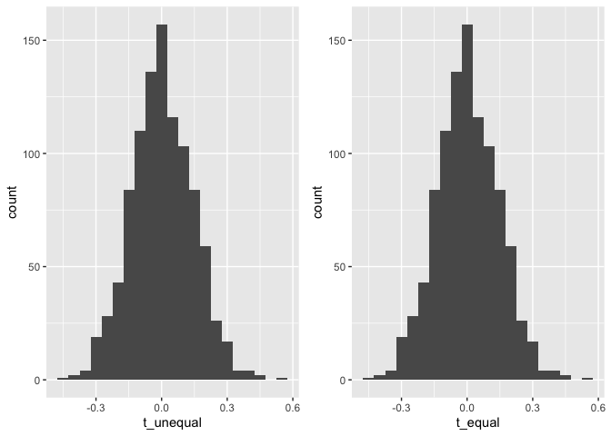
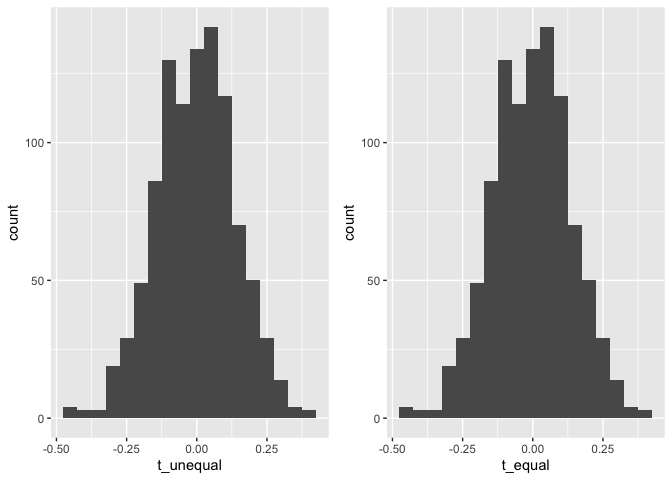
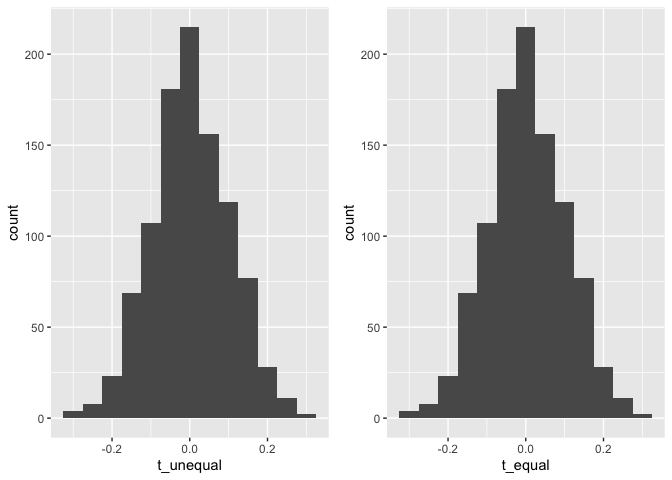
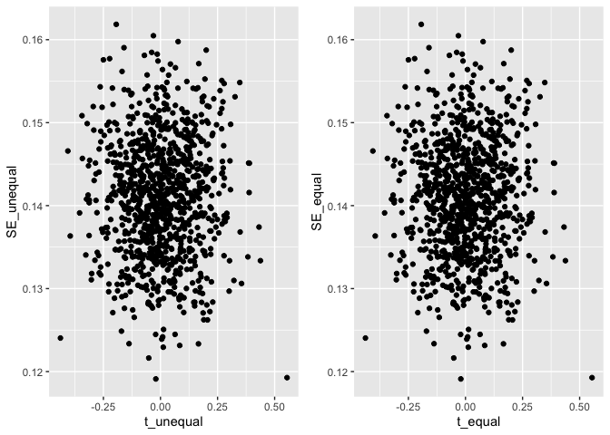
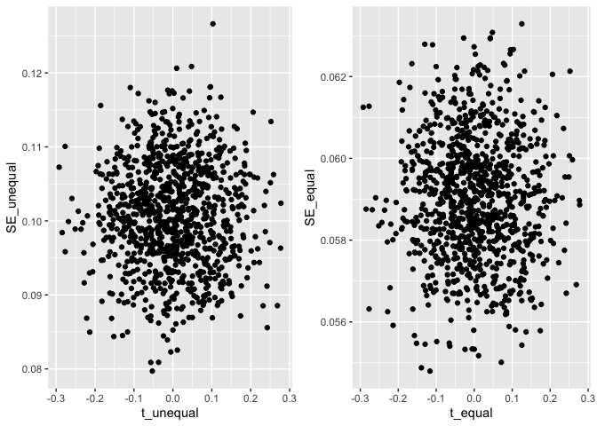

Which t-test should I use? A simulation study comparing the Student and
Welsh t-test
================
Group 2 - Lily, Daniel, Anna and Em,
2023-06-22

## Study Design

### Aim

To compare the performance of two different specifications of the
two-sample t test when variances are unequal and group sizes are both
equal and unequal

### Data Generation Mechanisms

We decided on 9 different DGMS, varying both the sample sizes and the
degree to which the variance differed. They were as follows:

``` r
nsim <- 1000
dgm <- 1:9
n1 <- c(rep(100,9))
n2 <- c(100,200,1000,100,200,1000,100,200,1000)
mu1 <- c(rep(5,9))
mu2 <- c(rep(5,9))
sd1 <- c(rep(10,9))
sd2 <- c(20,30,5,20,30,5,20,30,5)
df <- data.frame(n1,n2,mu1,mu2,sd1,sd2)
df
```

    ##    n1   n2 mu1 mu2 sd1 sd2
    ## 1 100  100   5   5  10  20
    ## 2 100  200   5   5  10  30
    ## 3 100 1000   5   5  10   5
    ## 4 100  100   5   5  10  20
    ## 5 100  200   5   5  10  30
    ## 6 100 1000   5   5  10   5
    ## 7 100  100   5   5  10  20
    ## 8 100  200   5   5  10  30
    ## 9 100 1000   5   5  10   5

### Estimand(s)

The estimand was the difference in means.

### Methods

We compared two different t-tests, one of which was just a standard
Student’s t-test (which assumes equal variances), and one which allows
for different variances in the two groups (Welch’s t-test). We therefore
had two methods:

1)  standard t-test (t_equal)
2)  Welch t-test (t_unequal)

### Performance

We aimed to look at bias and coverage together with monte carlo standard
errors. We also conducted a number of sense checks: - plotting the
estimated mean differences - comparing the model-based and empirical
standard errors

We ran 1000 simulations.

## Simulation set-up

``` r
library(foreach)
library(dplyr)
library(tidyr)
library(ggplot2)

set.seed(1234)

sim <- function(n1,n2,mu1,mu2,sd1,sd2,dgm){

df1 <- data.frame(id = 1:n1, group = 1, value = rnorm(n1,mu1,sd1))
df2 <- data.frame(id = 1:n2, group = 2, value = rnorm(n2,mu2,sd2))

ttest <- t.test(y = df1$value, x = df2$value, paired = FALSE, var.equal = FALSE)
diff_means <- ttest$statistic
CI_lower <- ttest$conf.int[1]
CI_upper <- ttest$conf.int[2]
SE <- ttest$stderr

ttest1 <- t.test(y = df1$value, x = df2$value, var.equal  = TRUE, paired = FALSE)
diff_means1 <- ttest1$statistic
CI_lower1 <- ttest1$conf.int[1]
CI_upper1 <- ttest1$conf.int[2]
SE1 <- ttest1$stderr

output <- data.frame(diff_means,CI_lower,CI_upper,SE,diff_means1,CI_lower1,CI_upper1,SE1,dgm)
colnames(output) <- c("t_unequal","lower_unequal","upper_unequal","SE_unequal","t_equal","lower_equal", "upper_equal","SE_equal","DGM")
output
}
```

Running the simulation:

``` r
simulation <- foreach(j = dgm) %do% {
  foreach(i=1:nsim, .combine = "rbind") %do% {
  sim(n1[j],n2[j],mu1[j],mu2[j],sd1[j],sd2[j],j)
}
}
test <- data.frame(do.call(rbind.data.frame, simulation))
```

## Results

### Sense checks

Check the mean for each DGM in a histogram

``` r
library(cowplot)
check_mean <- function(dgm){
  plot1 <- ggplot(subset(test, DGM == dgm), aes(x =t_unequal)) +
    geom_histogram(binwidth = 0.05)
  plot2 <- ggplot(subset(test, DGM == dgm), aes(x =t_equal)) +
    geom_histogram(binwidth = 0.05)
  hist_mean <- plot_grid(plot1, plot2)
  hist_mean
}
check_mean(1)
```

<!-- -->

``` r
check_mean(2)
```

<!-- -->

``` r
check_mean(3)
```

<!-- -->

``` r
check_mean(4)
```

<!-- -->

``` r
check_mean(5)
```

<!-- -->

``` r
check_mean(6)
```

<!-- -->

``` r
check_mean(7)
```

<!-- -->

``` r
check_mean(8)
```

<!-- -->

``` r
check_mean(9)
```

<!-- --> Check
mean/se:

``` r
check_mean_se <- function(dgm){
  plot1 <- ggplot(subset(test, DGM == dgm), aes(x =t_unequal, y=SE_unequal)) +
    geom_point()
  plot2 <- ggplot(subset(test, DGM == dgm), aes(x =t_equal, y=SE_equal)) +
    geom_point()
  hist_mean_se <- plot_grid(plot1, plot2)
  hist_mean_se
}
check_mean_se(1)
```

<!-- -->

``` r
check_mean_se(2)
```

<!-- -->

``` r
check_mean_se(3)
```

<!-- -->

``` r
check_mean_se(4)
```

<!-- -->

``` r
check_mean_se(5)
```

<!-- -->

``` r
check_mean_se(6)
```

<!-- -->

``` r
check_mean_se(7)
```

<!-- -->

``` r
check_mean_se(8)
```

<!-- -->

``` r
check_mean_se(9)
```

<!-- -->

## Results: bias

bias of t_equal:

``` r
test %>%
  group_by(DGM) %>%
  summarise(
    bias = mean(t_equal) - (0),
    empSE = sqrt(var(t_equal)),
    modSE = mean(SE_equal)
  )
```

    ## # A tibble: 9 × 4
    ##     DGM      bias empSE modSE
    ##   <int>     <dbl> <dbl> <dbl>
    ## 1     1  0.0294   1.00  2.22 
    ## 2     2 -0.000379 0.749 3.09 
    ## 3     3 -0.110    1.64  0.591
    ## 4     4 -0.0628   0.984 2.23 
    ## 5     5 -0.0149   0.775 3.08 
    ## 6     6 -0.0406   1.73  0.591
    ## 7     7 -0.0346   0.998 2.23 
    ## 8     8  0.00794  0.786 3.08 
    ## 9     9  0.0303   1.69  0.590

bias of t_unequal:

``` r
test %>%
  group_by(DGM) %>%
  summarise(
    bias = mean(t_unequal) - (0),
    empSE = sqrt(var(t_unequal)),
    modSE = mean(SE_unequal)
  )
```

    ## # A tibble: 9 × 4
    ##     DGM      bias empSE modSE
    ##   <int>     <dbl> <dbl> <dbl>
    ## 1     1  0.0294   1.00   2.22
    ## 2     2 -0.000238 0.984  2.35
    ## 3     3 -0.0653   0.967  1.01
    ## 4     4 -0.0628   0.984  2.23
    ## 5     5 -0.0199   1.02   2.34
    ## 6     6 -0.0217   1.02   1.01
    ## 7     7 -0.0346   0.998  2.23
    ## 8     8  0.0105   1.03   2.34
    ## 9     9  0.0174   0.997  1.01

## Full outputs from rsimsum

results for t_equal

``` r
library(rsimsum)
s <- simsum(data = test, estvarname = "t_equal",
    se = "SE_equal", true = 0, by = "DGM") 
results_equal <- summary(s)
results_equal
```

    ## Values are:
    ##  Point Estimate (Monte Carlo Standard Error)
    ## 
    ## Non-missing point estimates/standard errors:
    ##  Estimate DGM
    ##      1000   1
    ##      1000   2
    ##      1000   3
    ##      1000   4
    ##      1000   5
    ##      1000   6
    ##      1000   7
    ##      1000   8
    ##      1000   9
    ## 
    ## Average point estimate:
    ##  Estimate DGM
    ##    0.0294   1
    ##   -0.0004   2
    ##   -0.1100   3
    ##   -0.0628   4
    ##   -0.0149   5
    ##   -0.0406   6
    ##   -0.0346   7
    ##    0.0079   8
    ##    0.0303   9
    ## 
    ## Median point estimate:
    ##  Estimate DGM
    ##    0.0131   1
    ##   -0.0017   2
    ##   -0.1489   3
    ##   -0.0822   4
    ##   -0.0132   5
    ##   -0.0673   6
    ##   -0.0187   7
    ##    0.0235   8
    ##   -0.0255   9
    ## 
    ## Average variance:
    ##  Estimate DGM
    ##    4.9646   1
    ##    9.5801   2
    ##    0.3500   3
    ##    5.0036   4
    ##    9.5004   5
    ##    0.3499   6
    ##    4.9949   7
    ##    9.5038   8
    ##    0.3485   9
    ## 
    ## Median variance:
    ##  Estimate DGM
    ##    4.9493   1
    ##    9.5876   2
    ##    0.3490   3
    ##    4.9703   4
    ##    9.4410   5
    ##    0.3498   6
    ##    4.9893   7
    ##    9.4697   8
    ##    0.3479   9
    ## 
    ## Bias in point estimate:
    ##          Estimate DGM
    ##   0.0294 (0.0317)   1
    ##  -0.0004 (0.0237)   2
    ##  -0.1100 (0.0519)   3
    ##  -0.0628 (0.0311)   4
    ##  -0.0149 (0.0245)   5
    ##  -0.0406 (0.0548)   6
    ##  -0.0346 (0.0316)   7
    ##   0.0079 (0.0249)   8
    ##   0.0303 (0.0533)   9
    ## 
    ## Empirical standard error:
    ##         Estimate DGM
    ##  1.0021 (0.0224)   1
    ##  0.7488 (0.0168)   2
    ##  1.6424 (0.0367)   3
    ##  0.9842 (0.0220)   4
    ##  0.7746 (0.0173)   5
    ##  1.7335 (0.0388)   6
    ##  0.9984 (0.0223)   7
    ##  0.7864 (0.0176)   8
    ##  1.6870 (0.0377)   9
    ## 
    ## Mean squared error:
    ##         Estimate DGM
    ##  1.0040 (0.0497)   1
    ##  0.5602 (0.0255)   2
    ##  2.7070 (0.1142)   3
    ##  0.9717 (0.0448)   4
    ##  0.5996 (0.0276)   5
    ##  3.0038 (0.1314)   6
    ##  0.9970 (0.0447)   7
    ##  0.6179 (0.0282)   8
    ##  2.8440 (0.1229)   9
    ## 
    ## Model-based standard error:
    ##         Estimate DGM
    ##  2.2281 (0.0041)   1
    ##  3.0952 (0.0043)   2
    ##  0.5916 (0.0005)   3
    ##  2.2369 (0.0042)   4
    ##  3.0823 (0.0048)   5
    ##  0.5916 (0.0005)   6
    ##  2.2349 (0.0041)   7
    ##  3.0828 (0.0046)   8
    ##  0.5903 (0.0005)   9
    ## 
    ## Relative % error in standard error:
    ##           Estimate DGM
    ##  122.3506 (4.9901)   1
    ##  313.3438 (9.2630)   2
    ##  -63.9777 (0.8062)   3
    ##  127.2674 (5.1011)   4
    ##  297.9126 (8.9216)   5
    ##  -65.8753 (0.7637)   6
    ##  123.8528 (5.0235)   7
    ##  292.0205 (8.7878)   8
    ##  -65.0059 (0.7832)   9
    ## 
    ## Coverage of nominal 95% confidence interval:
    ##         Estimate DGM
    ##  0.9990 (0.0010)   1
    ##  1.0000 (0.0000)   2
    ##  0.5060 (0.0158)   3
    ##  1.0000 (0.0000)   4
    ##  1.0000 (0.0000)   5
    ##  0.4800 (0.0158)   6
    ##  1.0000 (0.0000)   7
    ##  1.0000 (0.0000)   8
    ##  0.5150 (0.0158)   9
    ## 
    ## Bias-eliminated coverage of nominal 95% confidence interval:
    ##         Estimate DGM
    ##  0.9990 (0.0010)   1
    ##  1.0000 (0.0000)   2
    ##  0.5070 (0.0158)   3
    ##  1.0000 (0.0000)   4
    ##  1.0000 (0.0000)   5
    ##  0.4830 (0.0158)   6
    ##  1.0000 (0.0000)   7
    ##  1.0000 (0.0000)   8
    ##  0.5140 (0.0158)   9
    ## 
    ## Power of 5% level test:
    ##         Estimate DGM
    ##  0.0010 (0.0010)   1
    ##  0.0000 (0.0000)   2
    ##  0.4940 (0.0158)   3
    ##  0.0000 (0.0000)   4
    ##  0.0000 (0.0000)   5
    ##  0.5200 (0.0158)   6
    ##  0.0000 (0.0000)   7
    ##  0.0000 (0.0000)   8
    ##  0.4850 (0.0158)   9

results for t_uneqal

``` r
s <- simsum(data = test, estvarname = "t_unequal",
    se = "SE_unequal", true = 0, by = "DGM") 
results_unequal <- summary(s)
results_unequal
```

    ## Values are:
    ##  Point Estimate (Monte Carlo Standard Error)
    ## 
    ## Non-missing point estimates/standard errors:
    ##  Estimate DGM
    ##      1000   1
    ##      1000   2
    ##      1000   3
    ##      1000   4
    ##      1000   5
    ##      1000   6
    ##      1000   7
    ##      1000   8
    ##      1000   9
    ## 
    ## Average point estimate:
    ##  Estimate DGM
    ##    0.0294   1
    ##   -0.0002   2
    ##   -0.0653   3
    ##   -0.0628   4
    ##   -0.0199   5
    ##   -0.0217   6
    ##   -0.0346   7
    ##    0.0105   8
    ##    0.0174   9
    ## 
    ## Median point estimate:
    ##  Estimate DGM
    ##    0.0131   1
    ##   -0.0023   2
    ##   -0.0833   3
    ##   -0.0822   4
    ##   -0.0171   5
    ##   -0.0397   6
    ##   -0.0187   7
    ##    0.0310   8
    ##   -0.0143   9
    ## 
    ## Average variance:
    ##  Estimate DGM
    ##    4.9646   1
    ##    5.5352   2
    ##    1.0261   3
    ##    5.0036   4
    ##    5.4918   5
    ##    1.0287   6
    ##    4.9949   7
    ##    5.5005   8
    ##    1.0198   9
    ## 
    ## Median variance:
    ##  Estimate DGM
    ##    4.9493   1
    ##    5.5216   2
    ##    1.0209   3
    ##    4.9703   4
    ##    5.4674   5
    ##    1.0220   6
    ##    4.9893   7
    ##    5.4796   8
    ##    1.0157   9
    ## 
    ## Bias in point estimate:
    ##          Estimate DGM
    ##   0.0294 (0.0317)   1
    ##  -0.0002 (0.0311)   2
    ##  -0.0653 (0.0306)   3
    ##  -0.0628 (0.0311)   4
    ##  -0.0199 (0.0322)   5
    ##  -0.0217 (0.0323)   6
    ##  -0.0346 (0.0316)   7
    ##   0.0105 (0.0327)   8
    ##   0.0174 (0.0315)   9
    ## 
    ## Empirical standard error:
    ##         Estimate DGM
    ##  1.0021 (0.0224)   1
    ##  0.9835 (0.0220)   2
    ##  0.9665 (0.0216)   3
    ##  0.9842 (0.0220)   4
    ##  1.0174 (0.0228)   5
    ##  1.0209 (0.0228)   6
    ##  0.9984 (0.0223)   7
    ##  1.0326 (0.0231)   8
    ##  0.9969 (0.0223)   9
    ## 
    ## Mean squared error:
    ##         Estimate DGM
    ##  1.0040 (0.0497)   1
    ##  0.9664 (0.0438)   2
    ##  0.9375 (0.0400)   3
    ##  0.9717 (0.0448)   4
    ##  1.0344 (0.0474)   5
    ##  1.0416 (0.0462)   6
    ##  0.9970 (0.0447)   7
    ##  1.0652 (0.0483)   8
    ##  0.9932 (0.0438)   9
    ## 
    ## Model-based standard error:
    ##         Estimate DGM
    ##  2.2281 (0.0041)   1
    ##  2.3527 (0.0030)   2
    ##  1.0129 (0.0022)   3
    ##  2.2369 (0.0042)   4
    ##  2.3435 (0.0033)   5
    ##  1.0143 (0.0022)   6
    ##  2.2349 (0.0041)   7
    ##  2.3453 (0.0032)   8
    ##  1.0099 (0.0022)   9
    ## 
    ## Relative % error in standard error:
    ##           Estimate DGM
    ##  122.3506 (4.9901)   1
    ##  139.2102 (5.3589)   2
    ##    4.8049 (2.3553)   3
    ##  127.2674 (5.1011)   4
    ##  130.3406 (5.1620)   5
    ##   -0.6476 (2.2327)   6
    ##  123.8528 (5.0235)   7
    ##  127.1364 (5.0896)   8
    ##    1.2972 (2.2767)   9
    ## 
    ## Coverage of nominal 95% confidence interval:
    ##         Estimate DGM
    ##  0.9990 (0.0010)   1
    ##  1.0000 (0.0000)   2
    ##  0.9540 (0.0066)   3
    ##  1.0000 (0.0000)   4
    ##  1.0000 (0.0000)   5
    ##  0.9430 (0.0073)   6
    ##  1.0000 (0.0000)   7
    ##  1.0000 (0.0000)   8
    ##  0.9540 (0.0066)   9
    ## 
    ## Bias-eliminated coverage of nominal 95% confidence interval:
    ##         Estimate DGM
    ##  0.9990 (0.0010)   1
    ##  1.0000 (0.0000)   2
    ##  0.9550 (0.0066)   3
    ##  1.0000 (0.0000)   4
    ##  1.0000 (0.0000)   5
    ##  0.9430 (0.0073)   6
    ##  1.0000 (0.0000)   7
    ##  1.0000 (0.0000)   8
    ##  0.9540 (0.0066)   9
    ## 
    ## Power of 5% level test:
    ##         Estimate DGM
    ##  0.0010 (0.0010)   1
    ##  0.0000 (0.0000)   2
    ##  0.0460 (0.0066)   3
    ##  0.0000 (0.0000)   4
    ##  0.0000 (0.0000)   5
    ##  0.0570 (0.0073)   6
    ##  0.0000 (0.0000)   7
    ##  0.0000 (0.0000)   8
    ##  0.0460 (0.0066)   9

## Interpretation

- Surprisingly, the mean and SE was exactly the same for the student and
  Welsh t-test when the sample size was the same (although p-values were
  different)
- The empirical SE was quite different from the model-based SE
- other thoughts???
